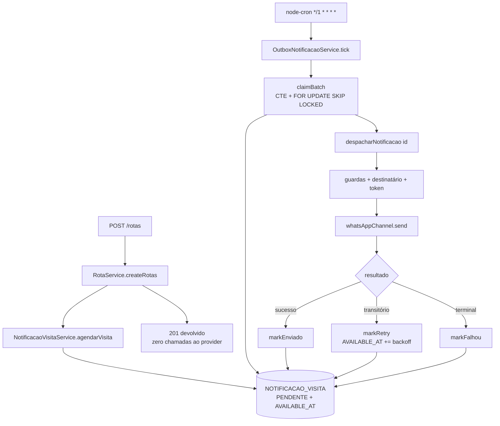

# Agendamento de Envio da Notificação de Visita (Outbox) Design

**Spec**: `.specs/features/agendamento-notificacao-visita/spec.md`
**Status**: Draft

---

## Architecture Overview

The send flow is cut in two at the point where it stops being cheap. Route creation writes a queued row and returns; a cron-driven worker claims due rows atomically and runs the existing dispatch flow against them.

The claim, lease, attempt and backoff semantics are **ported from `backend-communities/service/outbox`**, which already runs this pattern in production against `CRM.integration_outbox`. This design reproduces those semantics on `NOTIFICACAO_VISITA` instead of introducing a second table, per the spec's Option 2 decision.



Two properties carry the whole design:

1. **The database is the clock and the arbiter.** Due-ness is `AVAILABLE_AT <= now()` evaluated by Postgres; ownership is decided by `FOR UPDATE SKIP LOCKED`. Neither depends on which machine is running, how many there are, or whether their clocks agree.
2. **Cron is not load-bearing.** It only decides when to *look*. This is why reusing `node-cron` here does not reintroduce the duplicate-send problem that cron caused before — the same reasoning `backend-communities` already relies on.

---

## Code Reuse Analysis

### Existing Components to Leverage

| Component | Location | How to Use |
| --- | --- | --- |
| `OutboxService` (claim SQL, lease, backoff, `shouldMarkFailed`) | `../backend-communities/service/outbox/OutboxService.ts` | **Port**, adapted to this table. Copy `computeBackoffMs` verbatim; copy the CTE claim shape; drop `normalizeLockedRow`/`toText` (unneeded — we return one integer column). |
| `OutboxPublisher` cron loop | `../backend-communities/schedule/crons/OutboxPublisher.ts` | Same structure: batch claim → per-row try/catch → mark. **Do not** copy the `markRetry(id, 1, …)` batch-failure reset (see Risks). |
| `NotificacaoVisitaService.notificarVisita` | `service/notificacaoVisitaService.ts:195` | Split, not rewritten. Everything from the guards onward becomes `despacharNotificacao`; the row creation at the top becomes `agendarVisita`. |
| `finalizar` helper | `service/notificacaoVisitaService.ts` | Already the single write path for terminal states; the new mark* helpers use it so `UPDATED_AT` and logging stay uniform. |
| `whatsAppChannel` + its `ChannelSendResult` | `channels/whatsappChannel.ts` | Untouched. Its `reason` values are what classify transient vs terminal — the local equivalent of the target's `temporaryError` flag. |
| `date-fns-tz` | installed, but **imported nowhere in this repo** | First use here, not a reuse — `proximoHorarioEnvio` needs its own unit tests rather than assumed-correct behaviour. No install step required. |
| `node-cron` | already a dependency (unimported) | Tick source, same as the target. |
| `AppDataSourceSync.query` | `data-source.ts` | Raw SQL path for the claim, as the target does. |

### Integration Points

| System | Integration Method |
| --- | --- |
| `CAMPANHAS_OB.NOTIFICACAO_VISITA` | Four added columns via `scripts/migration-outbox-notificacao-visita.sql` (`ALTER`, superseding the 2026-08-07 no-ALTER decision); existing columns and the STATUS check constraint unchanged. |
| `RotaService.createRotas` | Calls `agendarVisita` instead of `notificarVisita`; keeps its per-route try/catch. |
| `app.ts` | Registers the cron when `OUTBOX_VISITA_ENABLED === '1'`. |
| Future shared delivery system | Replaces `OutboxNotificacaoService` only; `despacharNotificacao` remains the unit of work it calls. |

---

## Components

### OutboxNotificacaoService

- **Purpose**: Own the queue mechanics — claim due rows, drive dispatch, decide retry vs terminal. The single seam the future migration replaces.
- **Location**: `service/outboxNotificacaoService.ts`
- **Interfaces**:
  - `claimBatch(batchSize: number, workerId: string): Promise<number[]>` — the CTE claim; returns claimed IDs.
  - `tick(): Promise<void>` — claim, then dispatch each row; never throws.
  - `markEnviado(id, resultado): Promise<void>` — `ENVIADO`, clears lease.
  - `markRetry(id, attempts, erro): Promise<void>` — stays `PENDENTE`, clears lease, pushes `AVAILABLE_AT` by `computeBackoffMs(attempts)`.
  - `markFalhou(id, erro): Promise<void>` — terminal, clears lease.
  - `shouldMarkFailed(attempts, transitorio): boolean` — ported semantics: `!transitorio || attempts >= OUTBOX_VISITA_MAX_ATTEMPTS`.
- **Dependencies**: `AppDataSourceSync`, `NotificacaoVisitaService.despacharNotificacao`.
- **Reuses**: `OutboxService` (ported), `computeBackoffMs` (verbatim).

### NotificacaoVisitaService (modified)

- **Purpose**: Keep owning the domain flow; gain a scheduling entry point and lose the "send right now" assumption.
- **Location**: `service/notificacaoVisitaService.ts`
- **Interfaces**:
  - `agendarVisita(rota, cache?): Promise<NotificacaoVisita>` — creates `PENDENTE` + `AVAILABLE_AT`, nothing else. Never throws.
  - `despacharNotificacao(id: number): Promise<ResultadoDespacho>` — loads the row, runs guards → recipient → token → channel, returns `{ desfecho: 'ENVIADO' | 'DISPENSADO' | 'FALHOU_TERMINAL' | 'FALHOU_TRANSITORIO', erro?, resultado? }` **without** deciding retry policy.
  - `notificarVisita(rota, cache?)` — retained as `agendar` + immediate `despachar`, for **tests and the manual console only**. AGND-21 forbids any production route-creation path from calling it, enforced by a test asserting `RotaService` calls `agendarVisita`. Its doc comment must say so, since the signature alone invites the inline-send regression this feature removes.
- **Dependencies**: unchanged.
- **Reuses**: the entire existing body of `notificarVisita`, re-homed.

**Why `despacharNotificacao` returns a verdict instead of persisting retry state**: it is the piece that must survive the migration. If it decided backoff, the shared system would inherit this service's retry policy; returning a classification lets whoever owns the queue apply its own.

### Classificação transitório vs terminal

- **Purpose**: Map `ChannelSendResult.reason` onto the target's `temporaryError` boolean.
- **Location**: `service/outboxNotificacaoService.ts` (const map)
- **Rule**: `network error`, `provider error`, `provider rate/quota` → transient. `invalid phone`, `channel not configured`, and every guard outcome (`DISPENSADO`, no recipient, no phone, workshop missing, campaign ended) → terminal.

### scripts/outboxConsole.ts

- **Purpose**: Drive the queue from the terminal so the feature can be exercised end-to-end without waiting for 09:00 (AGND-16…19).
- **Location**: `scripts/outboxConsole.ts`, registered as npm scripts alongside `whatsapp:mock`.
- **Interfaces** (subcommands):
  - `status` — counts by STATUS, rows due now, and the next rows with `AVAILABLE_AT`, `ATTEMPTS`, `LOCKED_BY`, `ERRO_ENVIO`.
  - `tick [--vezes N]` — runs `OutboxNotificacaoService.tick()` in the foreground and prints each row's outcome; runs regardless of `OUTBOX_VISITA_ENABLED`, since invoking it is explicit intent.
  - `agendar <--rota ID | --notificacao ID>` — sets `AVAILABLE_AT = now()`, clears the lease, and returns a terminal row to `PENDENTE` with `ATTEMPTS = 0`. Refuses a `CONFIRMADO` row.
- **Dependencies**: `AppDataSourceSync`, `OutboxNotificacaoService`.
- **Reuses**: the CLI shape of `scripts/db-query.ts`; the dispatch path itself, so a manual tick exercises production code rather than a parallel implementation.

**Why a CLI and not an HTTP route**: a "run the queue now" endpoint would be a new privileged surface on a service that already exposes public, token-authenticated confirmation endpoints, and it would ship to production for the sake of local testing. The script has no route, no auth surface, and cannot be reached from outside the machine.

**Safety**: `tick` sends for real only under the same conditions as the cron — the channel's three locks still apply, so `NODE_ENV=test` no-ops, and `WHATSAPP_SEND_ENABLED` must be `"true"`. Paired with `WHATSAPP_TEST_PHONE_OVERRIDE`, a manual run reaches only the developer's own number.

### utils/agendamento.ts

- **Purpose**: The scheduling rule, isolated so it is testable without a real clock.
- **Location**: `utils/agendamento.ts`
- **Interfaces**: `proximoHorarioEnvio(agora: Date, hora?: number): Date` — next occurrence of `hora` in America/São_Paulo strictly after `agora`. Returns `agora` unchanged when `OUTBOX_VISITA_ENVIO_IMEDIATO === '1'` (AGND-16), so the testing switch lives in one function rather than at the call site.
- **Dependencies**: `date-fns-tz`.

### schedule/outboxNotificacaoCron.ts

- **Purpose**: Tick source and process-level guards.
- **Location**: `schedule/outboxNotificacaoCron.ts`
- **Interfaces**: `registrarOutboxCron(): void` — no-op unless `OUTBOX_VISITA_ENABLED === '1'` and `NODE_ENV !== 'test'`.
- **Reuses**: structure of `OutboxPublisher.ts`; `workerId = outbox-visita-${process.pid}`.

---

## Data Models

```typescript
// entities/NotificacaoVisita.ts — added columns
@Column({ type: "timestamptz", nullable: true, name: "AVAILABLE_AT" })
AVAILABLE_AT?: Date | null;      // null = pre-outbox row, never claimable

@Column({ type: "timestamptz", nullable: true, name: "LOCKED_AT" })
LOCKED_AT?: Date | null;

@Column({ type: "varchar", length: 120, nullable: true, name: "LOCKED_BY" })
LOCKED_BY?: string | null;       // outbox-visita-<pid>

@Column({ type: "int", default: 0, name: "ATTEMPTS" })
ATTEMPTS?: number;
```

```typescript
// service/notificacaoVisitaService.ts
export type DesfechoDespacho =
  | { desfecho: "ENVIADO"; messageId: string | null; providerMessageId: string | null }
  | { desfecho: "DISPENSADO"; motivo: string }
  | { desfecho: "FALHOU_TERMINAL"; erro: string }
  | { desfecho: "FALHOU_TRANSITORIO"; erro: string };
```

**Relationships**: unchanged — one row per `RotaPromotor`, `UNIQUE(ID_ROTA_PROMOTOR)` still the dedup guarantee.

**Mapping to the target** (`CRM.integration_outbox`): `AVAILABLE_AT`↔`available_at`, `LOCKED_AT`↔`locked_at`, `LOCKED_BY`↔`locked_by`, `ATTEMPTS`↔`attempts`, `ERRO_ENVIO`↔`last_error`, `PENDENTE`/`ENVIADO`/`FALHOU`↔`PENDING`/`PUBLISHED`/`FAILED`.

---

## Error Handling Strategy

| Error Scenario | Handling | User Impact |
| --- | --- | --- |
| Enqueue write fails during route creation | Caught in `RotaService`; route creation still succeeds | Route created, no notification — visible as a missing row |
| Claim query fails | Tick logs and returns; no rows were claimed, so nothing is stuck | None; next tick retries |
| Dispatch throws mid-row | Per-row catch → `markRetry` with the **real** attempt count | Message arrives on a later tick, or retires at the ceiling |
| Process dies holding a lease | `LOCKED_AT` ages past the lease; another worker claims it | Possible duplicate message (accepted at-least-once) |
| Provider transient failure | `markRetry`, `AVAILABLE_AT` pushed by the backoff ladder | Delivery delayed by up to 15 min per step |
| Provider config failure | Terminal `FALHOU` on the first attempt | No message; `ERRO_ENVIO` names the provider code |
| Batch-level crash after claiming | Each claimed row is released with its true attempt count preserved | Rows retry normally instead of looping forever |

---

## Risks & Concerns

| Concern | Location (file:line) | Impact | Mitigation |
| --- | --- | --- | --- |
| Target's batch-failure handler resets `attempts` to `1` | `../backend-communities/schedule/crons/OutboxPublisher.ts:116` | A row that reliably crashes the batch never reaches `MAX_ATTEMPTS` — infinite retry | Not ported. This implementation passes the row's real `ATTEMPTS`. Worth reporting upstream. |
| Guards now run hours after enqueue | `service/notificacaoVisitaService.ts:226-244` | A route created today can resolve `DISPENSADO` tomorrow — a behaviour change ops will see | Intended and specced (AGND-09); visible via existing `ERRO_ENVIO` reasons |
| First deploy could re-send historical `PENDENTE` rows | `entities/NotificacaoVisita.ts` | Mass duplicate messages to real workshops | `AVAILABLE_AT IS NOT NULL` in the claim predicate (AGND-13) + a pre-enable `SELECT count(*)` check |
| `notificarVisita` currently swallows everything and always returns a row | `service/notificacaoVisitaService.ts:352` | The catch-all makes a transient failure indistinguishable from a terminal one, which the retry decision now depends on | `despacharNotificacao` returns an explicit verdict; the catch-all maps to `FALHOU_TRANSITORIO` so unknown crashes retry rather than retiring silently |
| `rotaService.NOTIFICACOES_SIMULTANEAS = 5` pool exists only to bound inline sends | `service/rotaService.ts:51` | Dead complexity once enqueue is a single insert | Simplify to a plain loop in the same task that changes the call site |
| Integration tests hit the real dev DB and the claim query is time-sensitive | `__tests__/integration/` | Flaky or, worse, a test that claims rows another run is using | Test rows carry the `__TEST_` marker convention already in use, and claim tests scope by explicit IDs |
| No index on `(STATUS, AVAILABLE_AT)` before this change | `CAMPANHAS_OB.NOTIFICACAO_VISITA` | Claim query degrades as the table grows | Partial index shipped in the same migration |
| `OUTBOX_VISITA_ENVIO_IMEDIATO=1` leaking into a deployed env | `utils/agendamento.ts` | Every notification becomes due at import time — exactly the 23:40 behaviour this feature removes | Default-off, absent from deployed `.env`s, documented as local-only in `.env.example`, and logged loudly by `agendarVisita` whenever it takes effect |
| Manual `tick` racing the running cron | `scripts/outboxConsole.ts` | Two workers, one row — but this is the designed case, not a bug | `SKIP LOCKED` + `LOCKED_BY` make it safe and traceable; the console prints its own worker id (`outbox-visita-cli-<pid>`) so ops can tell which one claimed what |

---

## Tech Decisions

| Decision | Choice | Rationale |
| --- | --- | --- |
| Where scheduling state lives | Columns on `NOTIFICACAO_VISITA` | One store, no drift; the columns are meaningful history after the migration |
| Claim SQL shape | CTE `picked` + `UPDATE … FROM picked` | Same as the target, so the query is reviewable by anyone who knows the other service |
| `ATTEMPTS` incremented at claim | Yes, in the claim statement | A crash mid-dispatch still burns an attempt; prevents a poison row from looping forever |
| Claim returns only the ID | Yes | Avoids the target's ~90 lines of driver-shape defensiveness; the dispatcher re-reads via the repository |
| Retry policy owner | `OutboxNotificacaoService`, not the dispatch function | Keeps the dispatch unit portable to the shared system |
| Env var names/values | Mirror the target (`OUTBOX_*`, `'1'`) | Ops configures both services the same way, despite differing from local `WHATSAPP_SEND_ENABLED="true"` |
| Keep `notificarVisita` | Yes, as agendar + despachar | Existing callers and unit tests keep a synchronous path; avoids a wide test rewrite in the same change |

> **Project-level decisions** already recorded in `.specs/project/STATE.md` (2026-08-13): outbox over cron/Redis, and guards moving to send time.
