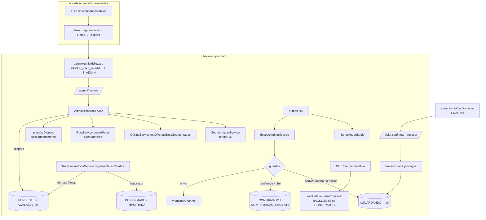
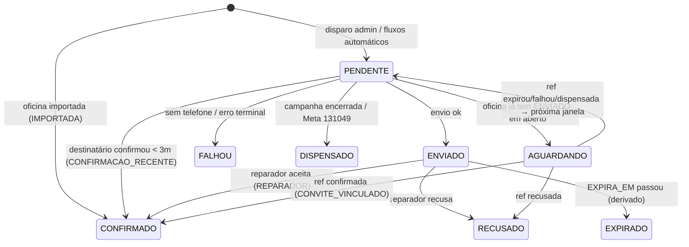

# Disparo de Convite de Visita (Admin) Design

**Spec**: `.specs/features/disparo-convite-visita-admin/spec.md`
**Context**: `.specs/features/disparo-convite-visita-admin/context.md`
**Status**: Draft

Três repos, uma fonte da verdade:

- **`backend-promotor`**: domínio, fila, guardas, auth de admin, recusa.
- **`ob-ads`**: tela de admin.
- **`jornalOficinaBrasil`**: botão Recusar na página do reparador.

`frontend-promotor` não muda.

---

## Approach (escolhido + alternativas)

**Escolhido: A. O convite é a própria `NOTIFICACAO_VISITA` de uma `ROTA_PROMOTOR` que já existe, e "aceito" é um único status (`CONFIRMADO`) com uma coluna de origem.**

- A rota nasce em `BACKLOG` e não aparece para o promotor até a notificação chegar a `CONFIRMADO`.
- Cada forma de aceite (pelo reparador, por confirmação recente, por convite vinculado, por ser oficina importada) é um valor de `ORIGEM_ACEITE`, não um status novo.
- A regra do app fica em uma linha: BACKLOG aparece se `statusEfetivo === CONFIRMADO`.

| Alternativa | Por que não |
| --- | --- |
| **B. Tabela `CONVITE_VISITA` sem rota; a rota é criada no aceite** | Reescreve o outbox, o token, `trocarToken`, `transicionar`, a guarda de fim de campanha e o `UNIQUE(ID_ROTA_PROMOTOR)`, todos presos à rota (`NotificacaoVisita.ID_ROTA_PROMOTOR NOT NULL UNIQUE`). O promotor e o mapa precisam da rota antes do aceite, para mostrar a quem cada oficina vai; sem rota, isso vira uma segunda estrutura. É o dobro do código para o mesmo comportamento. |
| **C. Coluna `ORIGEM` em `ROTA_PROMOTOR` + regra de visibilidade combinando rota e notificação** | Duas fontes para a pergunta "está aceita?". A regra do app, o painel do admin e a propagação do convite vinculado teriam de ler as duas. Também contraria a decisão de `OFICINA_IMPORTADA` de não pôr origem na rota (`entities/OficinaImportada.ts:13-16`). |

---

## Architecture Overview



### Máquina de estados de `NOTIFICACAO_VISITA`



Sai da máquina antiga uma transição: `PENDENTE → DISPENSADO` por endereço recente (CONV-25). Os estados novos são `AGUARDANDO` e `RECUSADO`; `REAGENDADO` continua reservado.

---

## Code Reuse Analysis

### Existing Components to Leverage

| Component | Location | How to Use |
| --- | --- | --- |
| Outbox (claim `SKIP LOCKED`, backoff, tick) | `service/outboxNotificacaoService.ts:216,420` | Sem mudança no claim. O tick ganha um passo antes do claim: `liberarAguardando`. |
| `despacharNotificacao` | `service/notificacaoVisitaService.ts:368-465` | Troca as guardas (sem endereço recente; convite aberto por oficina vira `AGUARDANDO`; confirmação recente vira `CONFIRMADO`) e a resolução de telefone. |
| `agendarVisitasEmLote` (bulk `orIgnore` no `UNIQUE`) | `notificacaoVisitaService.ts:302` | O disparo usa o mesmo insert com `AVAILABLE_AT` vindo de `planejarDisparo`. O `orIgnore` é o que garante CONV-22 e CONV-24. |
| `proximoHorarioEnvio` / janela | `utils/agendamento.ts:88,100` | Generalizado para um dia com deslocamento (`horarioNoDia`) e usado por `planejarDisparo`. |
| `normalizarTelefone` | `utils/telefone.ts:46-83` | Normaliza todos os candidatos; `ehCelular` (novo) filtra os de fallback. |
| `transicionar` (update atômico) | `service/visitaConfirmacaoService.ts:414-461` | Generalizado para o destino `CONFIRMADO` ou `RECUSADO`, e propaga para as `AGUARDANDO` na mesma transação. |
| `visitaAuthMiddleware` + `limitadorAcao` | `routes/VisitaRoute.ts` | `POST /visita/recusar` usa os dois, igual a `/confirmar` (CONV-40). |
| `createDocumentedRoute` | `utils/routeDocumentation.ts:48` | Padrão de todas as rotas novas (zod + middlewares + doc). |
| `resolveTenantId` / `previewContactsAll` | `service/segmentacaoService.ts:17,79` | Chamados com tenant fixo 15 em vez do tenant da campanha. |
| `ligacaoCadastroEmpresa`, `COLUNAS_CADASTRO_EMPRESA` | `utils/sqlCadastroEmpresa.ts:46,118` | Join canônico `OFICINA` → `dw.cadastro_empresa` (o `id_oficina` não é único lá). |
| `GeolocationService.getLatLongByCep` | `service/geolocationService.ts:117` | Converte CEP em coordenadas para a região CEP + raio. |
| Regra do mais próximo (haversine, desempate por `ID_CAMPANHA_PROMOTOR`) | `service/rotaService.ts:1036-1042,1163-1169` | Extraída para uma função pura reusada pela distribuição automática do admin (CONV-18). |
| `resolverNomeEmpresa` | `notificacaoVisitaService.ts:204-224` | Mesmo mapeamento `EMPRESA_SLUG → COMMUNITIES.Nome`, só que feito em SQL, com join, na lista de campanhas. |
| `OFICINA_IMPORTADA` | `scripts/migration-oficina-importada.sql` | Critério de "importada" (AD-001, conforme). |
| Wizard do cliente | `ob-ads/app/(dashboard)/dashboard/campanha-para-promotores/components/wizard/` | Reusa `WizardMap` (props puras) e `wizard-theme.ts`. `CriterioValorInput` ganha uma prop opcional com a função de busca dos valores. Não reusa `CampanhaWizard`, `StepPromotores` nem `PromotorModal`, que dependem de `useClientId` e do rascunho do cliente. |
| Grid pt-BR (MUI DataGrid v8) | `ob-ads/.../campanha-para-promotores/page.tsx:7,29-35` | Mesmo `localeText` na lista de campanhas do admin. |
| Página do reparador | `jornalOficinaBrasil/app/(visita)/visita/confirmacao/` | Ação e estado novos no `useVisitaConfirmacao` (reducer) e duas telas novas no `VisitaConfirmacaoClient`. |

### Integration Points

| System | Integration Method |
| --- | --- |
| backend-ob-ads (login) | Nenhuma chamada. O backend-promotor só verifica a assinatura do JWT que o backend-ob-ads emitiu (`UsuarioService.ts:119-121`) com `OBADS_JWT_SECRET`. |
| CRM (`@obcrm/segmentation`) | `previewContactsAll(dsl, 15, 5000)` e filter-options do tenant 15. Continua dependendo de `CRM_API_URL`, que falta no dev. |
| Postgres `CAMPANHAS_OB` | Uma migration: status, colunas e CHKs novos em `NOTIFICACAO_VISITA`, mais o backfill das importadas. |
| ob-ads → backend-promotor | `api_promotores` ganha um interceptor de request com `Bearer authToken`, cópia do de `api_ob_ads` (`service/api.ts:16-24`). |
| jornal → backend-promotor | `service/visitaService.ts` ganha `recusarVisita(jwt)` → `POST visita/recusar`. |

---

## Components

### backend-promotor

#### `adminAuthMiddleware` [NOVO]
- **Purpose**: Deixar passar só o JWT de admin emitido pelo backend-ob-ads (CONV-03, CONV-04).
- **Location**: `middlewares/adminAuthMiddleware.ts`
- **Interfaces**: `adminAuthMiddleware(req, res, next)`. Coloca em `req.admin` o objeto `{ idUsuario, nome, email }`.
- **Behavior**:
  - Sem `Authorization: Bearer <t>` → 401 `{ message: "Token não fornecido." }`.
  - `jwt.verify(t, OBADS_JWT_SECRET)` falhou (inválido ou expirado) → 401 `{ message: "Token inválido ou expirado." }`.
  - `user.IS_ADMIN` não verdadeiro (aceita `true` ou `1`) → 403 `{ message: "Acesso restrito a administradores." }`.
  - `OBADS_JWT_SECRET` ausente → 500, fechado por falta de configuração, sem chegar ao handler.
  - Não lê `SKIP_AUTH`.
- **Reuses**: Formato de erro de `middlewares/authMiddleware.ts`. **Não** reusa o `authMiddleware`, que espera o payload do `MAIN_REGISTER.USUARIO` e faz lookup no Postgres.

#### `AdminDisparoRoute` [NOVO], montada em `/admin`
- **Location**: `routes/AdminDisparoRoute.ts`, registrada em `api.ts` (`app.use("/admin", adminDisparoRoutes)`). Todas as rotas usam `middlewares: [adminAuthMiddleware]`.

| Método e path | Req | CONV |
| --- | --- | --- |
| `GET /admin/campanhas/ativas` | – | 01, 02 |
| `GET /admin/campanhas/:id/promotores` | – | 13 |
| `GET /admin/segmentacao/campos` | – | 12 |
| `GET /admin/segmentacao/valores?path=` | – | 12 |
| `POST /admin/campanhas/:id/oficinas/segmentar` | `{ regiao: {uf, cidade} \| {cep, raioKm}, filtroSegmentacao }` | 06-11, 43, 47 |
| `GET /admin/campanhas/:id/rotas` | `?estado=` | 41, 42 |
| `POST /admin/campanhas/:id/rotas` | `{ atribuicoes: [{idCampanhaPromotor, idOficina}] }` ou `{ distribuir: true, idOficinas: number[] }` | 14-18 |
| `POST /admin/campanhas/:id/disparos/previa` | `{ rotaIds: number[], tetoDiario }` | 19-21 |
| `POST /admin/campanhas/:id/disparos` | `{ rotaIds: number[], tetoDiario }` | 20-24 |

Excluir rota "não disparada" e vincular promotor ou ajustar o raio reusam os endpoints que já existem (`DELETE /rota/:id`, `createVinculo`, `updateVinculoRaio`) sem auth, como hoje. Fica registrado em Risks.

#### `AdminDisparoService` [NOVO]
- **Location**: `service/adminDisparoService.ts`
- **Interfaces**:
  - `listarCampanhasAtivas(agora): Promise<CampanhaAdminResumo[]>`: uma única query SQL. `CAMPANHA c` com `STATUS='PUBLICADA'`, `DELETED_AT IS NULL`, `START_TIME <= now` e `(END_TIME IS NULL OR END_TIME >= now)`. Faz `LEFT JOIN OFICINA_PORTAL.COMMUNITIES ON "EmpresaSlug" = c."EMPRESA_SLUG"` para trazer o `clienteNome` (nulo vira `—` na tela) e conta vínculos e rotas com subselects agregados. Sem N+1.
  - `listarPromotores(idCampanha)`: devolve `{ vinculados: [{ID_CAMPANHA_PROMOTOR, ID_PROMOTOR, NOME, RAIO, LAT, LNG}], doCliente: [{ID_PROMOTOR, NOME, LAT, LNG}] }`. `doCliente` é `PROMOTOR.ID_CLIENT = c.ID_CLIENT` sem vínculo ativo.
  - `segmentarOficinas(idCampanha, regiao, dsl): Promise<{ oficinas: OficinaSegmentada[], truncado, total }>`:
    1. Valida região e DSL (400).
    2. Chama `previewContactsAll(dsl, TENANT_OFICINA_BRASIL = 15, 5000)`; erro vira 502.
    3. Com CEP, converte em coordenadas via `getLatLongByCep`; CEP sem coordenada dá 400 "CEP não encontrado".
    4. Chama `OficinaService.getOficinasBaseSegmentadas`.
  - `criarRotas(idCampanha, entrada, idAdmin)`:
    - Validações: vínculo pertence à campanha; oficina fora de rota nesta campanha (409); sem recusa nesta campanha (409); com WhatsApp **ou** importada (422).
    - Chama `RotaService.createRotas(idCP, ids, idAdmin, { agendar: false })`.
    - Na distribuição, usa `escolherPromotorMaisProximo` e devolve `foraDoAlcance`.
    - Resposta: `{ criadas, conflitos: [{idOficina, motivo, promotorAtual?}], foraDoAlcance: number[] }`.
  - `previaDisparo(idCampanha, rotaIds, teto, agora)` / `disparar(...)`: veja *Disparo* abaixo.
  - `listarRotasComEstado(idCampanha, estado?)`: usa `estadoConvite(notificacao, agora)` (novo, puro) para devolver um de: `nao_disparada`, `agendada`, `enviada`, `aceita`, `aceita_confirmacao_recente`, `aceita_convite_vinculado`, `aceita_importada`, `recusada`, `expirada`, `falhou`, `dispensada`, `aguardando`. Também devolve `totaisPorEstado`.

#### Disparo (`planejarDisparo`) [NOVO, puro]
- **Location**: `utils/agendamento.ts`
- **Interfaces**:
  - `horarioNoDia(agora, diasAFrente: number, posicao, total): Date`. É `proximoHorarioEnvio` generalizado; `proximoHorarioEnvio(a,p,t) === horarioNoDia(a, 1, p, t)`.
  - `planejarDisparo(agora, n, teto): { slots: Date[], porDia: {data: string, quantidade: number}[], ultimoDia: string }`. O item `i` vai para o dia `1 + floor(i / teto)`, na posição `i % teto` entre os `min(teto, n - dia*teto)` daquele dia, espaçado pela janela.
  - `tetoMinimo(agora, n, fimCampanha): number | null`. É o menor teto cujo último slot cai `<= fimCampanha`; `null` se nem teto 1000 cabe.
- **Fluxo de `disparar`**:
  1. Valida o teto (inteiro de 1 a 1000, senão 400).
  2. Carrega as rotas: são da campanha e estão em `BACKLOG`.
  3. Separa as que já têm notificação (`jaDisparadas`).
  4. Planeja o restante.
  5. Se `ultimo slot > END_TIME`, responde 422 `{ message, tetoMinimo }`.
  6. Faz o bulk insert `PENDENTE` com `AVAILABLE_AT = slots[i]`, `.orIgnore()`.
  7. Devolve o resumo; `enfileiradas` é o número de linhas inseridas de fato.

  Um disparo concorrente só pode *reduzir* a quantidade de um dia, nunca aumentar (CONV-21, CONV-24). `previa` roda os passos 1 a 5 sem escrever nada.

#### `OficinaService.getOficinasBaseSegmentadas` [NOVO]
- **Location**: `service/oficinaService.ts`
- **Interface**: `getOficinasBaseSegmentadas(externalUserIds: number[], regiao: RegiaoResolvida, ctx: { idCampanha, empresaSlug }): Promise<OficinaSegmentada[]>`
- **SQL**:
  - `USUARIO us` com `ID_USUARIO IN (lotes de 1000)` → `OFICINA o` → `ligacaoCadastroEmpresa`, com o mesmo filtro de hoje (`ce.lat/lon` não nulos, `status_receita='ATIVA'`).
  - Região UF + cidade: `ce.estado = $uf AND translate(lower(ce.cidade), 'áàâãäéèêëíìîïóòôõöúùûüç', 'aaaaaeeeeiiiiooooouuuuc') = $cidadeNormalizada`. A cidade é normalizada igual no TS. `ce.estado` já vem em UF de 2 letras (medido: `SP`, `MG`...).
  - Região CEP + raio: haversine em SQL sobre `ce.latitude/longitude <= raioKm`.
  - Flags por `EXISTS` / `LEFT JOIN`:
    - `membroComunidade`: `USUARIO_COMMUNITY` + `COMMUNITIES.EmpresaSlug`.
    - `importada`: `OFICINA_IMPORTADA` ativa para o slug.
    - `rotaAtual`: `ROTA_PROMOTOR` + `CAMPANHA_PROMOTOR` da campanha, com o `STATUS` da notificação.
    - `recusouNestaCampanha`.
  - Seleciona os candidatos de telefone (`us.CELULAR`, `us.TELEFONE`, `o.TELEFONE`, `ce.telefone`); `temWhatsapp` sai de `resolverTelefone` no TS, a mesma função do despacho.
  - Deduplica por `ID_OFICINA`.
- **Teste**: afirma joins e aliases da SQL (lição L-004).

#### `resolverTelefone` [NOVO, puro] + `ehCelular` [NOVO]
- **Location**: `utils/telefone.ts`
- **Interfaces**:
  - `ehCelular(normalizado: string): boolean`. É verdade para `55` + DDD + `9` + 8 dígitos.
  - `resolverTelefone(c: { usuarios: {ID_USUARIO, CELULAR, TELEFONE}[] /* ordenados como hoje */, oficinaTelefone, cadastroTelefone }): { telefone, origem: TelefoneOrigem, idUsuario } | null`
- **Regra**:
  1. Primeiro usuário com `CELULAR` preenchido, na ordem de hoje: comportamento atual, qualquer formato que `normalizarTelefone` aceite.
  2. Sem nenhum `CELULAR`: primeiro candidato que normaliza **e** `ehCelular`, na ordem `USUARIO.TELEFONE` (mesma ordem de usuários), `OFICINA.TELEFONE`, `ce.telefone`.
  3. `idUsuario` é o do usuário do número. Nas fontes de oficina, é o primeiro usuário da ordem, porque o token precisa de `sub` (`trocarToken` exige `ID_USUARIO`).
  4. Sem usuário nenhum → `null`, o `MOTIVO_SEM_USUARIO` de hoje.

  Quando o `CELULAR` preenchido é inválido (`normalizarTelefone` devolve null), o comportamento atual é `FALHOU MOTIVO_TELEFONE_INVALIDO`. O design **mantém** isso e não cai para o fallback, que só entra quando **não há** celular (CONV-43 AC1).

#### `NotificacaoVisitaService` [MODIFICAR]
- `registrarRotasCriadas(rotas, { agendar }: { agendar: boolean })` [NOVO]. Substitui a chamada direta de `notificarRotasCriadas` → `agendarVisitasEmLote`.
  - Uma query decide quais rotas são de oficina importada para o slug da campanha. Essas recebem um insert `CONFIRMADO`, com `ORIGEM_ACEITE='IMPORTADA'`, `CONFIRMADO_EM=now()` e sem token (CONV-45).
  - As demais vão para `agendarVisitasEmLote` se `agendar`; senão, nada (admin, CONV-15).
  - Todos os fluxos que já existem passam `agendar: true`, e o comportamento deles não muda, exceto para as importadas.
- `despacharNotificacao` [MODIFICAR], nesta ordem:
  1. Oficina inexistente → `FALHOU`.
  2. ~~`enderecoRecente`~~ removido (CONV-25). A função fica em `envioGuards.ts` só se ainda tiver outro consumidor; se não tiver, é apagada junto com o teste.
  3. Campanha encerrada → `DISPENSADO`, como hoje.
  4. `convitePendenteDaOficina(ID_OFICINA, idNotificacao, agora)`. Se achar uma `ENVIADO` com `EXPIRA_EM >= agora` em outra rota da mesma oficina, grava `STATUS='AGUARDANDO'`, `ID_NOTIFICACAO_REFERENCIA=<id>`, `AVAILABLE_AT=NULL` (CONV-26).
  5. `resolverTelefone`; `null` → `FALHOU` com o motivo de hoje (CONV-43).
  6. `confirmacaoRecente(idUsuario, agora)`. Procura `CONFIRMADO` com **`ORIGEM_ACEITE='REPARADOR'`** e `CONFIRMADO_EM >= agora - 3 meses`. Se achar, grava `STATUS='CONFIRMADO'`, `ORIGEM_ACEITE='CONFIRMACAO_RECENTE'`, `CONFIRMADO_EM=agora`, `ID_NOTIFICACAO_REFERENCIA=<id>` (CONV-30). Contar só `REPARADOR` impede que um aceite automático renove a janela para sempre.
  7. Token, envio e `TELEFONE_ORIGEM` (CONV-44): segue o fluxo de hoje.
- `avaliarGuardas` [MODIFICAR]: vira duas funções, `convitePendenteDaOficina` e `confirmacaoRecente`. Mantém o `UPDATE` preguiçoso de `ENVIADO` vencida para `EXPIRADO`, agora por oficina. A guarda por usuário `MOTIVO_PENDENTE` sai: o convite em aberto passa a ser contado por oficina (Assumption da spec).

#### `outboxNotificacaoService.tick` [MODIFICAR]
- `liberarAguardando(agora)` [NOVO] roda antes do claim. É idempotente e seguro com N cópias do servidor. Um `UPDATE ... FROM` sobre `AGUARDANDO` olha a referência:
  - ref `CONFIRMADO` → `CONFIRMADO` / `CONVITE_VINCULADO`, `CONFIRMADO_EM=now()`.
  - ref `RECUSADO` → `RECUSADO`, `RECUSADO_EM=now()`.
  - ref `EXPIRADO`, `FALHOU`, `DISPENSADO`, ou `ENVIADO` com `EXPIRA_EM < now()` → `PENDENTE`, `AVAILABLE_AT = horarioNoDia(agora, 1, 0, 1)`, `ID_NOTIFICACAO_REFERENCIA = NULL` (CONV-29).

  É a rede de segurança da propagação síncrona feita em `transicionar`.

#### `VisitaConfirmacaoService` + `VisitaRoute` [MODIFICAR]
- `transicionar(payload, ip, destino: 'CONFIRMADO' | 'RECUSADO', extras)`:
  - Numa transação, o mesmo `UPDATE ... WHERE STATUS='ENVIADO' AND EXPIRA_EM > now`.
  - `CONFIRMADO` grava `ORIGEM_ACEITE='REPARADOR'`, `CONFIRMADO_*`. `RECUSADO` grava `RECUSADO_EM/POR/IP`.
  - Na mesma transação, propaga para `AGUARDANDO` com `ID_NOTIFICACAO_REFERENCIA = id` (CONV-27, CONV-28, CONV-36).
- `recusar(payload, ip): RecusaResult`: `DECLINED | ALREADY_CONFIRMED | ALREADY_DECLINED | EXPIRED | TOKEN_INVALID`.
- `trocarToken`: notificação `RECUSADO` → `{ state: 'ALREADY_DECLINED', empresaNome, recusadoEm }`.
- `confirmar` sobre uma notificação recusada → 409 `ALREADY_DECLINED` (CONV-37).
- Rota: `POST /visita/recusar`, `middlewares: [visitaAuthMiddleware, limitadorAcao]`, sem body. Respostas: 200 `DECLINED`, 409, 410 e 404 no mesmo formato de `/confirmar`.

#### `statusNotificacaoVisita.ts` [MODIFICAR]
- `rotaListavelParaPromotor`: fora de `BACKLOG` → true; em `BACKLOG` → `statusEfetivo(n) === CONFIRMADO` (CONV-31 a CONV-33). Os consumidores de `CONFIRMACAO_RESOLVIDA` saem ou são atualizados.
- `estadoConvite(n, agora)` [NOVO], para o painel do admin.

#### `RotaService` [MODIFICAR]
- `createRotas(idCP, idOficina, CREATED_BY?, opts: { agendar?: boolean } = { agendar: true })` → `NotificacaoVisitaService.registrarRotasCriadas`.
- `escolherPromotorMaisProximo(oficina, candidatos)` [EXTRAÍDO, puro] a partir de `:1036-1042` e `:1163-1169`, sem mudar o comportamento. Os dois pontos passam a chamá-lo.

### ob-ads

#### Área `/admin/disparo-visitas` [NOVO]
- `app/admin/page.jsx` [MODIFICAR]: card "Disparo de visitas" (`section: 'disparo-visitas'`). A área admin é toda `.jsx`, mas as páginas novas são `.tsx`, pela `CONVENTIONS.md`.
- `app/admin/disparo-visitas/page.tsx` [NOVO]: DataGrid pt-BR com as colunas Cliente, Nome, Período, Promotores, Rotas e a ação "Abrir".
- `app/admin/disparo-visitas/[id]/page.tsx` [NOVO] → `DisparoWizard` com 3 passos na URL (`?step=`), mais o cabeçalho da campanha:
  1. **Segmentação** (`StepRegiaoSegmentacao`): região (UF, cidade ou CEP + raio) e critérios. Os critérios reusam o builder de lista plana do passo do cliente, mas com os campos de `/admin/segmentacao/campos`, e `CriterioValorInput` recebe `buscarValores` apontando para `/admin/segmentacao/valores`. Sem região ou sem critério, o botão "Buscar oficinas" fica desabilitado.
  2. **Rotas** (`StepRotasAdmin`): `WizardMap` com as oficinas coloridas (da comunidade, de fora, importada, sem WhatsApp em cinza, já em rota com a cor do promotor) e os promotores vinculados com raio. Ao lado, a lista com seleção múltipla e "Atribuir a…", mais "Distribuir automaticamente" e "Remover". Os conflitos e o "fora do alcance" aparecem em toasts e badges.
  3. **Disparo** (`StepDisparo`): lista das rotas com `estadoConvite`, filtro por estado e totais (P2). O teto diário sai num campo numérico; "Ver prévia" mostra os dias e quantidades, e o `ConfirmModal` (reuso) confirma "Disparar N convites".
- `service/adminDisparoService.ts` [NOVO]: funções tipadas para cada endpoint `/admin/*`.
- `service/api.ts` [MODIFICAR]: interceptor de request em `api_promotores` que anexa `Bearer authToken`.
- `CriterioValorInput.tsx` [MODIFICAR]: prop opcional `buscarValores?: (path) => Promise<string[]>`, que cai para o comportamento atual quando ausente.
- Lógica pura testável (`lib/disparoVisitas.ts`): `validarRegiao`, `rotulosEstadoConvite`, `corOficina`. Testes Jest (`next/jest`).

### jornalOficinaBrasil

#### Página `/visita/confirmacao` [MODIFICAR]
- `service/visitaService.ts`:
  - `recusarVisita(jwt)` → `POST visita/recusar`.
  - `GetVisitaResponse` ganha `ALREADY_DECLINED`, em SCREAMING_SNAKE onde vier do backend, sem conversão para camelCase.
- `useVisitaConfirmacao.ts`:
  - Kinds novos: `confirming_decline` e `declined` / `already_declined`.
  - Ação `recusar()` com o mesmo retry de 401/403 (GET de novo e nova tentativa uma vez) e o mesmo mapeamento de 404, 410 e 429.
  - 409 → GET de novo.
- `VisitaConfirmacaoClient.tsx`:
  - Na tela pendente, um botão secundário "Não quero receber a visita" abaixo de "Próximo passo". Ele leva a um passo de confirmação: "Recusar a visita da {empresa}?", com os botões "Sim, recusar" e "Voltar".
  - Tela nova `DeclinedScreen`: "Visita recusada. Tudo certo — a {empresa} não fará esta visita." Nos dois estados, `declined` e `already_declined`.
- Testes Vitest nos três arquivos de teste que já existem.

---

## Data Models

### Migration `scripts/migration-convite-visita-admin.sql` [NOVO]

Segue as regras da casa:

- idempotente (`IF NOT EXISTS`, `DROP CONSTRAINT IF EXISTS` + `ADD`);
- cabeçalho com `ROLLBACK:`;
- `TEXT`, não `VARCHAR`;
- sem linha em branco nem `;` em comentário dentro de um statement.

A skill `dba-rules` é carregada antes de escrever.

```sql
-- NOTIFICACAO_VISITA
ALTER TABLE "CAMPANHAS_OB"."NOTIFICACAO_VISITA"
  ADD COLUMN IF NOT EXISTS "ORIGEM_ACEITE" TEXT NULL,             -- REPARADOR | CONFIRMACAO_RECENTE | CONVITE_VINCULADO | IMPORTADA
  ADD COLUMN IF NOT EXISTS "ID_NOTIFICACAO_REFERENCIA" INT NULL
      REFERENCES "CAMPANHAS_OB"."NOTIFICACAO_VISITA"("ID_NOTIFICACAO_VISITA"),
  ADD COLUMN IF NOT EXISTS "RECUSADO_EM" TIMESTAMPTZ NULL,
  ADD COLUMN IF NOT EXISTS "RECUSADO_POR" INT NULL,
  ADD COLUMN IF NOT EXISTS "RECUSADO_IP" TEXT NULL,
  ADD COLUMN IF NOT EXISTS "TELEFONE_ORIGEM" TEXT NULL;           -- USUARIO_CELULAR | USUARIO_TELEFONE | OFICINA_TELEFONE | CADASTRO_EMPRESA_TELEFONE
-- CHK_NOTIFICACAO_VISITA_STATUS: + 'AGUARDANDO', 'RECUSADO'
-- CHK novo: STATUS='RECUSADO' => RECUSADO_EM NOT NULL
-- CHK novo: STATUS='CONFIRMADO' => ORIGEM_ACEITE NOT NULL (depois do backfill abaixo)
-- CHK novo: STATUS='AGUARDANDO' => ID_NOTIFICACAO_REFERENCIA NOT NULL
-- CHK novo: ORIGEM_ACEITE IN (...) / TELEFONE_ORIGEM IN (...)
-- INDEX parcial: ("ID_NOTIFICACAO_REFERENCIA") WHERE "STATUS" = 'AGUARDANDO'
-- Backfill 1: CONFIRMADO existentes -> ORIGEM_ACEITE = 'REPARADOR'
-- Backfill 2 (CONV-46): notificações não CONFIRMADO/RECUSADO de rotas cuja oficina tem
--   OFICINA_IMPORTADA ativa no EMPRESA_SLUG da campanha -> CONFIRMADO / IMPORTADA,
--   CONFIRMADO_EM = now(), AVAILABLE_AT/LOCKED_* = NULL
-- Backfill 3 (CONV-46): rotas importadas sem notificação -> INSERT CONFIRMADO / IMPORTADA
```

O `CANAL` é `NOT NULL`, com o default de hoje. A linha `IMPORTADA` usa `'WHATSAPP'`, porque o canal não é enviado, e a coluna de origem deixa isso explícito. `TOKEN_HASH` e `EXPIRA_EM` ficam nulos, o que satisfaz o CHK de par que já existe.

### Tipos (TS)

```ts
type StatusNotificacaoVisita =
  'PENDENTE'|'ENVIADO'|'FALHOU'|'DISPENSADO'|'CONFIRMADO'|'EXPIRADO'|'REAGENDADO'|'AGUARDANDO'|'RECUSADO';
type OrigemAceite = 'REPARADOR'|'CONFIRMACAO_RECENTE'|'CONVITE_VINCULADO'|'IMPORTADA';
type TelefoneOrigem = 'USUARIO_CELULAR'|'USUARIO_TELEFONE'|'OFICINA_TELEFONE'|'CADASTRO_EMPRESA_TELEFONE';

type RegiaoEntrada = { uf: string; cidade: string } | { cep: string; raioKm: number };

interface OficinaSegmentada {
  ID_OFICINA: number; NOME: string; CIDADE: string; ESTADO: string; CEP: string;
  LATITUDE: number; LONGITUDE: number;
  membroComunidade: boolean; importada: boolean; temWhatsapp: boolean;
  recusouNestaCampanha: boolean;
  rotaAtual: { ID_ROTA_PROMOTOR: number; ID_CAMPANHA_PROMOTOR: number; promotorNome: string; estado: EstadoConvite } | null;
}

interface CampanhaAdminResumo {
  ID_CAMPANHA: number; NOME: string; EMPRESA_SLUG: string | null; clienteNome: string | null;
  START_TIME: string; END_TIME: string | null; totalPromotores: number; totalRotas: number;
}

interface ResumoDisparo {
  enfileiradas: number; jaDisparadas: number;
  porDia: { data: string /* YYYY-MM-DD, America/Sao_Paulo */; quantidade: number }[];
  ultimoDia: string;
}
```

---

## Error Handling Strategy

| Error Scenario | Handling | User Impact |
| --- | --- | --- |
| Sem token, token inválido ou expirado | 401 no `adminAuthMiddleware` | ob-ads mostra "Sessão expirada, entre novamente". |
| Token válido sem `IS_ADMIN` | 403 | "Acesso restrito a administradores". |
| `OBADS_JWT_SECRET` ausente | 500 antes do handler, com log | Tela mostra erro genérico; nada é disparado. |
| Sem região ou sem critério | 400 com mensagem da spec | Botão já fica desabilitado; a mensagem é defesa extra. |
| CEP sem coordenada | 400 "CEP não encontrado" | Campo CEP marcado com erro. |
| CRM fora do ar ou lento | 502 "Segmentação indisponível" | Toast; a lista e a seleção anteriores continuam. |
| Varredura atingiu 5000 contatos | `truncado: true` | Aviso "Resultado parcial: refine a segmentação". |
| Oficina já em rota, recusou, ou sem WhatsApp e não importada | 409 ou 422 por item, em `conflitos` | Badge por oficina; as demais atribuições seguem. |
| Teto inválido | 400 | Campo marcado. |
| Disparo passa do fim da campanha | 422 `{ tetoMinimo }` sem escrever | "Não cabe até {fim}. Use pelo menos {tetoMinimo}/dia." |
| Disparo concorrente | `orIgnore` no `UNIQUE(ID_ROTA_PROMOTOR)` | O resumo conta como `jaDisparadas`. |
| Recusa ou confirmação sobre estado terminal | 409 com o estado | Tela vai para "já confirmada" ou "já recusada". |
| Falha no WhatsApp | Backoff e `FALHOU` do outbox, como hoje | O admin vê "falhou". |

---

## Risks & Concerns

| Concern | Location (file:line) | Impact | Mitigation |
| --- | --- | --- | --- |
| **O `.env` do backend-promotor parece apontar para um banco de produção.** O classificador de permissões bloqueou uma leitura como "Production Reads", e as suítes de integração usam banco real (`__tests__/integration/setup.ts`) | `backend-promotor/.env` (`DB_HOST`) | Rodar `test:integration` ou a migration no Execute pode escrever em produção | **Bloqueante para o Execute:** o usuário confirma para qual banco o `.env` aponta. As tasks rodam só `test:unit` + supertest com service mockado até haver um banco de teste confirmado. A migration não é aplicada pelo agente. |
| Regra global some com rotas no deploy (ENVIADO, PENDENTE, DISPENSADO, FALHOU, sem notificação) | `utils/statusNotificacaoVisita.ts:74-89` | Promotores podem ficar sem agenda até as oficinas responderem | Decisão do usuário. A task de deploy inclui um `SELECT` de impacto por campanha antes de subir. |
| `JWT_SECRET` do ob-ads embutido no bundle do cliente | `ob-ads/next.config.mjs:31-33` | Quem tem o segredo forja um token de admin, e isso vale também para o `OBADS_JWT_SECRET` desta feature | Fora de escopo (Out of Scope). Vira task separada. Enquanto não resolver, o ganho real da auth é barrar chamadas sem token, e isso fica declarado. |
| O middleware `/admin` do ob-ads confia no cookie `isAdmin`, gravável pelo cliente | `ob-ads/middleware.js:5-21` | Qualquer um vê a tela vazia | O backend é quem barra (401/403). A tela sem dados não vaza nada. |
| A claim `IS_ADMIN` vale por 7 dias sem revalidar | `backend-ob-ads/.../UsuarioService.ts:119` | Admin rebaixado mantém o acesso até o token expirar | Aceito. O `requireAdminMiddleware` do backend-ob-ads recarrega do banco, mas o backend-promotor não acessa o SQL Server. Registrado em Tech Decisions. |
| Tenant 15 tem 5 contatos neste banco, e `CRM_API_URL` falta no dev | memória do projeto, sondagem de 2026-09-28 | A segmentação não dá para demonstrar ponta a ponta local | O teste ponta a ponta fica para homolog (UAT). Os unitários mockam `previewContactsAll`. |
| Endpoints de vínculo, raio e exclusão de rota continuam sem auth | `routes/CampanhaRoute.ts:211,251` | A tela admin chama rotas abertas | Risco que já existe (`STATE.md`). O disparo, que é a parte irreversível, é autenticado. |
| `getActiveCampanhasBySlug` não filtra `STATUS='PUBLICADA'` | `service/rotaService.ts:773-790` | Auto-assign pode atribuir a campanha em rascunho | Que já existe, fora de escopo. A lista do admin usa SQL própria, que filtra. |
| Cidade com e sem acento | `dw.cadastro_empresa.cidade` | "Sao Paulo" e "São Paulo" não casariam | `translate(lower())` dos dois lados. Não depende de a extensão `unaccent` existir, o que não foi verificado. |
| Cobertura do fallback de telefone não foi medida | sondagem bloqueada | Não se sabe quantas das ~1.110 oficinas com usuário sem celular ganham número | A spec não depende do número. A task de UAT mede em homolog. |
| Aceite automático em cadeia | `envioGuards.ts` | Confirmação recente gerando confirmação recente para sempre | Só `ORIGEM_ACEITE='REPARADOR'` conta na guarda. Teste dedicado. |
| Suítes de integração com teardown de FK quebrado; `segmentacaoCampanhaPromotor.test.ts` vermelho desde antes | `.specs/project/STATE.md:37`, `.specs/STATE.md` Handoff | O gate de testes pode ficar vermelho por causa alheia | O gate por task usa o arquivo de teste da task mais `test:unit`. Os vermelhos que já existem ficam listados, sem mascarar. |
| `rotaListavelParaPromotor` também alimenta o contador X/Y do app | `frontend-promotor/components/home-screen.tsx:283` | O denominador muda | Consequência aceita (igual a FILT). |

---

## Tech Decisions (only non-obvious ones)

| Decision | Choice | Rationale |
| --- | --- | --- |
| Modelo do convite | Approach A: `NOTIFICACAO_VISITA` + `ORIGEM_ACEITE` | Uma fonte para "aceito", sem tabela nova, e reusa o outbox inteiro. |
| "Aguardando" | Status novo `AGUARDANDO` + `ID_NOTIFICACAO_REFERENCIA` | Explícito em `SELECT` e fácil de reconciliar. O `PENDENTE` com `AVAILABLE_AT` nulo já significa "linha antiga, nunca enviar" (AGND), e reusá-lo seria perigoso. |
| Propagação | Síncrona em `transicionar` + reconciliação idempotente no tick | Imediata no caso normal, e se corrige sozinha se a propagação falhar ou se o convite de referência expirar. |
| Guarda de confirmação recente | Conta só `REPARADOR` | Evita a cadeia infinita de aceites automáticos. |
| Segredo do admin | Variável nova `OBADS_JWT_SECRET` | O `JWT_SECRET` do backend-promotor assina o login do promotor e o token da visita (fallback). Reusá-lo, ou trocá-lo pelo do backend-ob-ads, quebraria esses dois. |
| Teto | Por disparo, por dia, calculado no insert | Sem contador global. A garantia vem do plano ser feito de uma vez só e do `orIgnore` só poder tirar linhas de um dia, nunca somar. |
| Importada | Decidida em `registrarRotasCriadas` para todos os fluxos | Um ponto só; importador, auto-assign, signup e admin obedecem sem código duplicado. |
| Tela admin | Wizard novo, reusando `WizardMap` e `CriterioValorInput` | `CampanhaWizard` e `StepPromotores` estão presos a `useClientId` e ao rascunho do cliente; generalizá-los arriscaria o fluxo do cliente, que está em produção. |

**Project-level decisions (a registrar em `.specs/STATE.md`):**

- **AD-003**: "aceito" = `CONFIRMADO` + `ORIGEM_ACEITE`. `GET /campanha/ativa` mostra uma rota em `BACKLOG` só se ela estiver `CONFIRMADO`. Substitui a regra de `filtro-rotas-por-confirmacao` (`CONFIRMACAO_RESOLVIDA`).
- **AD-004**: endpoints de admin do backend-promotor ficam em `/admin/*`, atrás de `adminAuthMiddleware` (`OBADS_JWT_SECRET` + claim `IS_ADMIN`). Endpoint de admin futuro reusa esse middleware.
- AD-001 (`OFICINA_IMPORTADA`) e AD-002 (`DATA_VISITA`/`ORDEM`): **conforme**, sem mudança. A tela admin não escreve `DATA_VISITA` nem `ORDEM`; as rotas nascem sem dia, como no fluxo do cliente.
