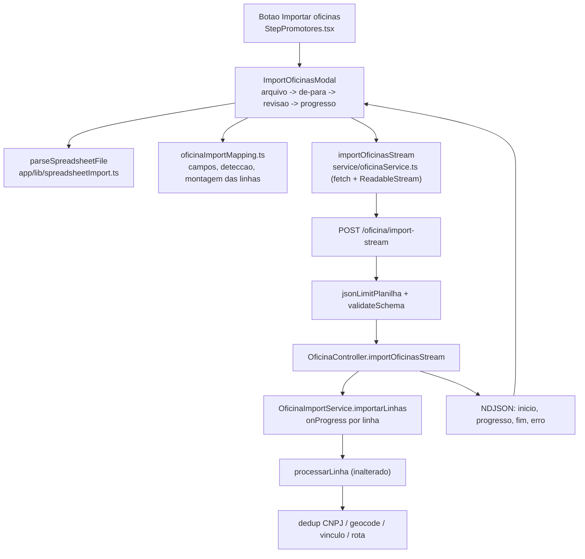

# Importador de Oficinas com De-Para e Relatório em Stream — Design

**Spec**: `.specs/features/importador-oficinas-de-para/spec.md`
**Context**: `.specs/features/importador-oficinas-de-para/context.md`
**Status**: Draft

---

## Conformidade com decisões de projeto

`AD-001` (`.specs/STATE.md`) segue ativa e este design **conforma**: o vínculo
oficina↔cliente continua sendo `CAMPANHAS_OB.OFICINA_IMPORTADA`, e nada aqui cria usuário
sintético em `USUARIO_COMMUNITY`. A feature troca o transporte da importação, não o que é gravado.

Lições confirmadas aplicadas:

- **L-002** (`scope:routes`) — a rota nova monta dois middlewares próprios (limite de corpo JSON e
  validação de schema). Cada um ganha teste de integração próprio, não basta estar montado.
- **L-004** (`scope:raw-sql`) — esta feature não escreve SQL novo; reaproveita as queries já
  cobertas de `oficinaImportService`. Sem aplicação direta.

---

## Exploração de abordagens

Três caminhos considerados para o transporte do progresso. Todos entregam o mesmo escopo.

| Abordagem | Como funciona | Custo | Veredito |
|---|---|---|---|
| **A. NDJSON em `POST`, lido com `fetch` + `ReadableStream`** | A resposta fica aberta e o servidor escreve uma linha JSON por evento | Não dá para usar o cliente axios do projeto; precisa de `fetch` cru nesta chamada | **Escolhida** |
| B. SSE (`text/event-stream`) | Mesma ideia com envelope `event:`/`data:` | `EventSource` só faz `GET`, então o de-para teria de ir por query string ou num `POST` anterior guardando estado no servidor | Descartada |
| C. Polling de um job id | `POST` cria o job e devolve id; o front consulta progresso a cada 2s | Exige fila, estado persistido de job e limpeza — arquitetura nova inteira para um pedido de barra de progresso | Descartada (fora de escopo na spec) |

**Consequência da escolha A:** `api_promotores` é uma instância axios, e axios no browser usa XHR,
que não expõe o corpo incrementalmente. A chamada de importação usa `fetch` direto, com a mesma
`baseURL` lida de `process.env.NEXT_PUBLIC_API_CAMPANHA_PROMOTOR`. O tratamento de erro replica o
interceptor de `api_promotores`: prefere `message` sobre `error`.

---

## Architecture Overview



O caminho antigo (`POST /oficina/import`, multipart) continua montado e passa a delegar ao mesmo
`importarLinhas`, de modo que as regras de linha existem num lugar só.

---

## Code Reuse Analysis

### Componentes existentes aproveitados

| Componente | Local | Como usar |
|---|---|---|
| `parseSpreadsheetFile`, `normalizeHeaderLabel`, `isRowBlank` | `app/(dashboard)/dashboard/automacao/utils/contactImport.js` | Extrair para `app/lib/spreadsheetImport.ts` e fazer `contactImport.js` importar de lá. Os testes existentes de `contactImport.test.js` passam a guardar a extração |
| `getMappingDuplicateColumnIndexArray` | mesmo arquivo | Mesma extração; regra de coluna repetida é idêntica nos dois importadores |
| Fluxo de passos do modal (Arquivo / Mapeamento / Revisão) | `automacao/components/ImportContactsModal.jsx` | Referência de estrutura e de interação. O novo modal é escrito com os tokens de `wizard-theme.ts`, não é um fork do arquivo |
| `OB`, tipografia do wizard | `components/wizard/wizard-theme.ts` | Toda a pele do modal novo (`UI-04`) |
| `MOTIVO_LABELS` | `components/wizard/importOficinaMotivoLabels.ts` | Reaproveitado tal como está no passo de resultado |
| `ImportOficinasResultModal` | `components/wizard/ImportOficinasResultModal.tsx` | O corpo vira o painel de resultado dentro do modal novo; o overlay próprio sai |
| `OficinaImportService.processarLinha` e auxiliares | `service/oficinaImportService.ts` | Reaproveitados sem alteração — é o que garante `API-07` |
| `executarComConcorrenciaLimitada` | mesmo arquivo | Mantém o teto de 8 linhas simultâneas (`API-10`) |
| `RotaService.prepararContextoAtribuicaoLote` | `service/rotaService.ts` | Contexto continua calculado uma vez por lote |
| `createDocumentedRoute` | `utils/routeDocumentation.ts` | Registro da rota nova com schema e documentação |

### Pontos de integração

| Sistema | Integração |
|---|---|
| `POST /oficina/import` (multipart) | Permanece montado e inalterado no contrato; internamente passa a chamar `importarLinhas` |
| `MAIN_REGISTER.OFICINA`, `CAMPANHAS_OB.OFICINA_IMPORTADA` | Sem mudança de schema |
| React Query | O modal invalida `['campanha', campanhaId]` e `['community-oficinas']` ao receber o evento `fim`, como a mutation atual já faz |

---

## Components

### `spreadsheetImport.ts` (extração)

- **Purpose**: leitura genérica de planilha e normalização de rótulo, compartilhada pelos dois importadores.
- **Location**: `ob-ads/app/lib/spreadsheetImport.ts`
- **Interfaces**:
  - `parseSpreadsheetFile(file: File): Promise<{ headerArray: string[]; rowArray: string[][] }>`
  - `normalizeHeaderLabel(value: unknown): string`
  - `isRowBlank(row: string[]): boolean`
  - `getMappingDuplicateColumnIndexArray(mapping: Record<string, number>): number[]`
- **Dependencies**: `xlsx`
- **Reuses**: corpo movido de `automacao/utils/contactImport.js`, incluindo o tratamento de CSV sem BOM

### `oficinaImportMapping.ts`

- **Purpose**: definir os campos de oficina, detectar o de-para inicial e montar as linhas a enviar.
- **Location**: `ob-ads/app/(dashboard)/dashboard/campanha-para-promotores/components/wizard/oficinaImportMapping.ts`
- **Interfaces**:
  - `OFICINA_FIELD_DEFINITIONS: { key, label, obrigatorio, aliases }[]`
  - `detectOficinaColumnMapping(headerArray: string[]): Record<string, number>`
  - `isOficinaMappingValid(mapping): boolean` — exige `CNPJ` e `CEP` (`UI-09`)
  - `buildOficinaArrayFromMapping(rowArray, mapping): { oficinaArray: LinhaOficinaImport[]; skippedRowNumberArray: number[] }` (`UI-12`, `UI-13`)
- **Dependencies**: `spreadsheetImport.ts`
- **Reuses**: mesmo formato de `CONTACT_FIELD_DEFINITIONS`, com `obrigatorio` acrescentado

### `ImportOficinasModal.tsx`

- **Purpose**: conduzir anexo, de-para, revisão, progresso e resultado num único modal.
- **Location**: `ob-ads/.../components/wizard/ImportOficinasModal.tsx`
- **Interfaces**: `{ open: boolean; campanhaId: number; onClose: () => void; onFinished: (r: ImportOficinasResult) => void }`
- **Dependencies**: `oficinaImportMapping.ts`, `importOficinasStream`, `wizard-theme.ts`, `MOTIVO_LABELS`
- **Reuses**: estrutura de passos do `ImportContactsModal`; corpo de resultado do `ImportOficinasResultModal`
- **Passos**: `intro` → `upload` → `mapping` → `review` → `progress` → `result`. O passo `intro` cumpre `UI-03`.

### `importOficinasStream` (cliente)

- **Purpose**: enviar as linhas mapeadas e entregar cada evento do NDJSON ao chamador.
- **Location**: `ob-ads/service/oficinaService.ts`
- **Interfaces**:
  - `importOficinasStream(params: { idCampanha: number; oficinas: LinhaOficinaImport[]; onEvent: (e: ImportStreamEvent) => void; signal?: AbortSignal }): Promise<ImportOficinasResult>`
- **Dependencies**: `fetch`, `TextDecoder`
- **Reuses**: mesma resolução de mensagem de erro do interceptor de `api_promotores`
- **Detalhe**: o buffer acumula até `\n`; a última linha só é processada quando o stream fecha. Se o
  stream fechar sem evento `fim`, a promise rejeita com `STREAM_INTERROMPIDO` (`STREAM-11`).

### `jsonLimitPlanilha` (middleware)

- **Purpose**: aceitar corpo JSON maior apenas nesta rota.
- **Location**: `backend-promotor/middlewares/jsonLimitPlanilha.ts`
- **Interfaces**: `express.json({ limit: "8mb" })`
- **Dependencies**: `express`
- **Motivo**: `app.ts:13` monta `express.json()` com o padrão de 100 kb. 5.000 linhas de oficina
  passam disso com folga e o corpo seria rejeitado com 413 antes de chegar ao controller. O limite
  global fica como está para não afrouxar todas as rotas.

### `OficinaImportService.importarLinhas`

- **Purpose**: processar um lote de linhas já mapeadas, reportando progresso.
- **Location**: `backend-promotor/service/oficinaImportService.ts`
- **Interfaces**:
  - `importarLinhas(linhas: LinhaOficinaImport[], idCampanha: number, createdBy?: number, onProgress?: (p: ProgressoImport) => void): Promise<ImportResult>`
- **Dependencies**: `CampanhaService`, `RotaService`, `GeolocationService`
- **Reuses**: `processarLinha`, `indicesComCnpjDuplicado`, `normalizarCnpj`, `executarComConcorrenciaLimitada`, `prepararContextoAtribuicaoLote` — todos sem alteração
- **Nota**: `importarPlanilha` passa a ser `parse + validarCabecalho + validarLimiteLinhas + mapear
  para LinhaOficinaImport + importarLinhas`. Nenhum requisito `IMPORT-NN` sobrevivente muda de comportamento.

### `OficinaController.importOficinasStream`

- **Purpose**: traduzir o progresso do serviço em NDJSON.
- **Location**: `backend-promotor/controllers/oficinaController.ts`
- **Interfaces**: `(req, res) => Promise<void>`
- **Dependencies**: `OficinaImportService`
- **Comportamento**:
  - Erros de pré-voo (`400`, `404`, `422`) saem como JSON comum, antes de qualquer cabeçalho de stream (`API-02`, `API-05`, `API-06`).
  - A partir do primeiro byte escrito, o status já é 200 e qualquer falha vira evento `erro` (`STREAM-06`).
  - Throttle de 500 ms vive aqui (`STREAM-03`), guardando o último instante emitido.
  - `res.write` de `inicio` acontece antes de chamar o serviço, para o front pintar a barra em zero.

---

## Data Models

```typescript
/** Uma linha já mapeada pelo de-para. Só CNPJ e CEP são obrigatórios. */
interface LinhaOficinaImport {
  nomeOficina?: string;
  cnpj: string;
  cep: string;
  endereco?: string;
  numero?: string;
  bairro?: string;
  estado?: string;
  cidade?: string;
}

interface ProgressoImport {
  processadas: number;
  total: number;
  oficinas_criadas: number;
  oficinas_vinculadas_existentes: number;
  ja_na_comunidade: number;
  erros: number;
}

type ImportStreamEvent =
  | { tipo: "inicio"; total: number }
  | { tipo: "progresso"; progresso: ProgressoImport }
  | { tipo: "fim"; resultado: ImportResult }
  | { tipo: "erro"; mensagem: string };
```

`ImportResult` é o tipo já existente em `service/oficinaImportService.ts`, sem mudança.

**Corpo da requisição:**

```typescript
interface ImportOficinasStreamBody {
  ID_CAMPANHA: number;
  oficinas: LinhaOficinaImport[]; // 1..5000
}
```

---

## Error Handling Strategy

| Cenário | Tratamento | O que o usuário vê |
|---|---|---|
| Extensão de arquivo não aceita | Validação no browser, antes de qualquer request | "Formato não suportado" no passo de anexo |
| Planilha sem linhas de dados | Validação no browser | "O arquivo não tem nenhuma linha de dados" |
| CNPJ ou CEP não mapeados | Botão de avançar desabilitado | Aviso explicando quais campos faltam |
| Corpo fora do schema | 400 antes de abrir o stream | Mensagem de erro no passo de revisão |
| Mais de 5.000 linhas | 400 antes de abrir o stream, e aviso no browser antes de enviar | Aviso com o teto |
| Campanha inexistente | 404 antes de abrir o stream | "Campanha não encontrada" |
| Campanha sem `EMPRESA_SLUG` | 422 antes de abrir o stream | "Campanha sem empresa vinculada" |
| Corpo acima de 8 MB | 413 do middleware de limite | Mensagem pedindo dividir o arquivo |
| Erro de linha | Contabilizado em `erros`, lote continua | Linha listada no resultado com o motivo traduzido |
| Falha inesperada durante o lote | Evento `erro` e stream encerrado | Aviso de interrupção com convite a reimportar |
| Conexão cai antes do `fim` | Promise rejeita com `STREAM_INTERROMPIDO` | Aviso de que reimportar o mesmo arquivo é seguro |

---

## Risks & Concerns

| Concern | Location | Impact | Mitigation |
|---|---|---|---|
| `express.json()` global de 100 kb | `app.ts:13` | Um lote grande morreria com 413 antes do controller, sem relação óbvia com a causa | Middleware de limite próprio na rota, com teste de integração dedicado (L-002) |
| Geocodificação serializada em 1 req/s | `service/geolocationService.ts:36` | Lote de oficinas inéditas leva dezenas de minutos; proxies podem cortar a conexão | O stream mantém tráfego contínuo, o que evita corte por ociosidade. A retomada é reimportar o arquivo, que é idempotente. Fila assíncrona está fora de escopo por decisão da spec |
| `parseArquivo` roda o SheetJS inteiro em memória | `service/oficinaImportService.ts:131` | No caminho novo isso deixa de existir, porque o parse passa a ser no browser | Sem ação; o caminho antigo permanece com o mesmo custo de hoje |
| Axios não entrega corpo incremental no browser | `ob-ads/service/api.ts` | Se a chamada de stream usasse `api_promotores`, a barra só se moveria no fim | A função de stream usa `fetch` e replica a regra de mensagem de erro do interceptor |
| Memória do `contactImport.js` sobre a URL da API estava desatualizada | `ob-ads/service/api.ts:27` | A `baseURL` de `api_promotores` vem de `NEXT_PUBLIC_API_CAMPANHA_PROMOTOR`, não está mais fixa no código | A função de stream lê a mesma variável de ambiente; a memória do projeto será corrigida |
| Nenhum teste cobre o caminho de erro pós-stream | novo código | Um `erro` mal formatado quebraria o parser do cliente silenciosamente | Teste de integração que força falha no meio do lote e afirma a última linha NDJSON |
| Extração de `contactImport.js` toca um módulo em produção | `automacao/utils/contactImport.js` | Uma extração malfeita quebra a importação de contatos | `contactImport.test.js` roda sem alteração e é o gate da extração |

---

## Tech Decisions

| Decisão | Escolha | Rationale |
|---|---|---|
| Transporte do progresso | NDJSON em `POST`, lido com `fetch` | `EventSource` não faz `POST` e o de-para exige corpo |
| Onde fica o throttle | Controller | Mantém o serviço livre de tempo, e portanto testável com progresso determinístico |
| Reaproveitamento das regras de linha | `importarPlanilha` delega a `importarLinhas` | Evita dois caminhos divergindo; é o que sustenta `API-07` |
| Limite de corpo | Middleware por rota, 8 MB | Não afrouxa o limite global das demais rotas |
| Campos obrigatórios do de-para | `CNPJ` e `CEP` | São a chave de dedup e a entrada da geocodificação; sem eles a linha é inprocessável |
| Extração do parser de planilha | `app/lib/spreadsheetImport.ts`, com `contactImport.js` consumindo | Uma fonte de verdade, e os testes existentes viram o gate da extração |
| Endpoint antigo | Mantido e marcado como deprecated na documentação da rota | O dashboard em produção o chama até o deploy do front novo |

Nenhuma decisão aqui é de nível de projeto, então nada é acrescentado a `.specs/STATE.md` `## Decisions`.

---

## Matriz de cobertura de testes

| Requisito | Onde é testado |
|---|---|
| UI-05, UI-07, UI-08, UI-09, UI-12, UI-13 | `oficinaImportMapping.test.js` (pure) |
| UI-01, UI-02, UI-03, UI-10, UI-11 | `ImportOficinasModal.test.jsx` (RTL) |
| UI-04 | Revisão visual, sem teste automatizado |
| API-01, API-07, API-09, API-10 | `__tests__/unit/oficinaImportService.test.ts` |
| API-02, API-03, API-05, API-06 | `__tests__/integration/oficinaImportStream.test.ts` |
| API-04 | `__tests__/unit/oficinaImportService.test.ts` |
| API-08 | Teste que envia chaves fora de ordem e sem cabeçalho e espera 200 |
| Limite de corpo de 8 MB | `__tests__/integration/oficinaImportStream.test.ts` (L-002) |
| STREAM-01 a STREAM-06 | `__tests__/integration/oficinaImportStream.test.ts` |
| STREAM-07 a STREAM-11 | `ImportOficinasModal.test.jsx` e `oficinaImportStreamClient.test.js` |
