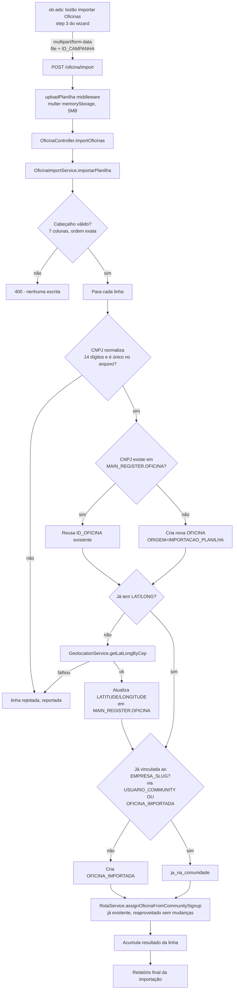

# Importador de Oficinas Design

**Spec**: `.specs/features/importador-oficinas/spec.md`
**Context**: `.specs/features/importador-oficinas/context.md`
**Status**: Draft

---

## Architecture Overview

Um único endpoint síncrono. O upload nunca toca `dw.cadastro_empresa` (ETL externo, read-only para este serviço) — toda escrita de import vai para `MAIN_REGISTER.OFICINA` (oficina em si) e para a tabela nova `CAMPANHAS_OB.OFICINA_IMPORTADA` (vínculo ao cliente). A atribuição de rota reaproveita, sem alterações, o método que já existe para o fluxo de inscrição em comunidade.



---

## Code Reuse Analysis

### Existing Components to Leverage

| Component | Location | How to Use |
|---|---|---|
| `RotaService.assignOficinaFromCommunitySignup(idOficina, empresaSlug)` | `service/rotaService.ts:792` | Reaproveitado **sem nenhuma mudança**. Já geocodifica/lê coordenadas, busca todas as campanhas ativas do `empresaSlug`, filtra promotores por raio (Haversine) e cria `ROTA_PROMOTOR` (idempotente). Chamado uma vez por oficina recém-vinculada (ou já vinculada, para cobrir novo promotor cadastrado depois). |
| `GeolocationService.getLatLongByCep(cep)` | `service/geolocationService.ts:117` | Reaproveitado como está (Nominatim → fallback Google Maps). Não usa `ENDERECO`/`NUMERO`/`CIDADE`/`ESTADO` da planilha — mesma convenção do resto do sistema, que geocodifica só por CEP. |
| `ligacaoCadastroEmpresa(aliasOficina, idOficinaExpr)` | `utils/sqlCadastroEmpresa.ts:109` | Reaproveitado nas 3 queries de "oficinas da comunidade" estendidas (seção Data Models) para expor `latitude`/`longitude`/`razao_social` etc. também para o ramo de oficinas importadas. |
| `cnpjIntParaLigacao(cnpj)` | `utils/sqlCadastroEmpresa.ts:144` | Reaproveitado para normalizar o CNPJ de cada linha da planilha (mesma regra: extrai dígitos, exige exatamente 14) antes de comparar contra `MAIN_REGISTER.OFICINA`. |
| `cnpjIntDaOficina(aliasOficina)` (hoje privada) | `utils/sqlCadastroEmpresa.ts:63` | Precisa ser exportada (não é código novo, só visibilidade) para a query de dedup por CNPJ usar exatamente a mesma expressão SQL já usada em `ligacaoCadastroEmpresa`, evitando duas implementações da mesma regra divergirem. |
| `CampanhaService.findCampanhaById(id)` | `service/campanhaService.ts:191` | Reaproveitado para resolver `EMPRESA_SLUG` a partir do `ID_CAMPANHA` recebido — nunca aceito diretamente do cliente. |
| `RotaService.createRotas` / `getOficinasAssignedInCampanha` / `getCandidatosPorCampanhas` | `service/rotaService.ts` | Usados indiretamente, dentro de `assignOficinaFromCommunitySignup` — nenhuma chamada direta nova. |
| `xlsx` (SheetJS) | dependência já instalada, hoje sem nenhum uso no código (`package.json`) | Primeiro uso real. `XLSX.read(buffer, { type: "buffer" })` lê `.xlsx` e `.csv` com a mesma API — não precisa de parser CSV separado. |
| `multer` | dependência já instalada, hoje sem nenhum uso no código | Primeiro uso real. `memoryStorage()` + `limits.fileSize` + `fileFilter` (extensão `.xlsx`/`.csv`). |
| `middlewares/validation.ts` (`validateSchema`) | já existente | Reaproveitado para validar `ID_CAMPANHA` do body multipart (Zod `coerce.number()`), no mesmo padrão dos outros endpoints. |
| `utils/routeDocumentation.ts` (`createDocumentedRoute`) | já existente | Reaproveitado para registrar a rota com o mesmo padrão OpenAPI dos demais endpoints de `OficinaRoute.ts`. |
| Campo `ORIGEM` em `Oficina` | `entities/Oficina.ts:53` (já existe, hoje sempre nulo) | Reaproveitado para marcar oficinas criadas por este fluxo (`"IMPORTACAO_PLANILHA"`) sem precisar de coluna nova. |

### Integration Points

| System | Integration Method |
|---|---|
| `MAIN_REGISTER.OFICINA` | Leitura (dedup por CNPJ) e escrita (criação de oficina nova; `UPDATE` de `LATITUDE`/`LONGITUDE` só quando estavam nulos — nunca sobrescreve os demais campos de uma oficina existente) |
| `CAMPANHAS_OB.OFICINA_IMPORTADA` (nova) | Escrita (um vínculo por oficina × cliente); leitura pelas 3 queries de comunidade estendidas |
| `CAMPANHAS_OB.CAMPANHA` | Leitura, só para resolver `EMPRESA_SLUG` a partir do `ID_CAMPANHA` recebido |
| `CAMPANHAS_OB.ROTA_PROMOTOR` | Escrita indireta, via `RotaService.assignOficinaFromCommunitySignup` (não modificado) |
| `dw.cadastro_empresa` | Somente leitura (via `ligacaoCadastroEmpresa`), nunca escrita — mantém o Non-Goal de não gravar no DW |

---

## Components

### `middlewares/uploadPlanilha.ts` (novo)

- **Purpose**: Middleware `multer` dedicado ao upload de planilhas, com `memoryStorage` (nunca grava em disco) e `fileFilter` restrito a `.xlsx`/`.csv`.
- **Location**: `middlewares/uploadPlanilha.ts`
- **Interfaces**:
  - `uploadPlanilha.single("file")` — middleware Express, expõe `req.file.buffer`
- **Dependencies**: `multer`
- **Reuses**: nenhum código existente (primeiro uso de `multer` no repositório)

### `OficinaImportService` (novo)

- **Purpose**: Orquestra parsing, validação, dedup/criação, geocodificação, vínculo e atribuição de rota — uma linha por vez, isolando falha de linha de falha de arquivo.
- **Location**: `service/oficinaImportService.ts`
- **Interfaces**:
  - `importarPlanilha(buffer: Buffer, idCampanha: number, createdBy?: number): Promise<ImportResult>` — método público único
  - `private parseArquivo(buffer: Buffer): string[][]` — usa `xlsx` para virar matriz de linhas
  - `private validarCabecalho(linhas: string[][]): void` — lança `HEADER_INVALIDO` se não bater
  - `private normalizarCnpj(valor: string): string | null` — reaproveita `cnpjIntParaLigacao`
  - `private buscarOuCriarOficina(linha: LinhaPlanilha): Promise<{ ID_OFICINA: number; criada: boolean }>`
  - `private garantirLatLong(idOficina: number, cep: string): Promise<{ lat: number; lon: number } | null>`
  - `private garantirVinculo(idOficina: number, empresaSlug: string, idCampanha: number, createdBy?: number): Promise<"criado" | "ja_vinculada">`
- **Dependencies**: `AppDataSourceSync` (repositório `Oficina` e `OficinaImportada`), `GeolocationService`, `RotaService`, `CampanhaService`, `xlsx`
- **Reuses**: ver Code Reuse Analysis

### `entities/OficinaImportada.ts` (novo)

- **Purpose**: Vínculo direto oficina↔cliente, independente de usuário/comunidade.
- **Location**: `entities/OficinaImportada.ts`
- **Reuses**: mesmo padrão de soft delete (`@DeleteDateColumn`) e timestamps das demais entidades `CAMPANHAS_OB.*`

### `OficinaController.importOficinas` (extensão)

- **Purpose**: Extrai `req.file` + `ID_CAMPANHA` validado, chama o service, mapeia erros para status HTTP.
- **Location**: `controllers/oficinaController.ts`
- **Interfaces**: `static importOficinas = async (req: Request, res: Response)`
- **Reuses**: mesmo padrão try/catch dos outros handlers do arquivo

### Extensão das queries de "oficinas da comunidade"

- **Purpose**: Fazer com que toda oficina vinculada via `OFICINA_IMPORTADA` apareça nas mesmas consultas que já alimentam mapa e atribuição automática de rota — sem duplicar lógica de raio/Haversine.
- **Location**: `service/oficinaService.ts` — `getComunityNearbyOficinas`, `getCommunityOficinas`, `countCommunityOficinas`
- **Mudança**: cada query passa a ser `SELECT DISTINCT ON (ID_OFICINA) * FROM ( <query atual> UNION ALL <ramo novo por OFICINA_IMPORTADA> ) combinado`, mantendo a mesma assinatura e formato de retorno.
- **Fora do escopo desta extensão**: `getSegmentedNearbyOficinas` / `getCommunityOficinasSegmentadas` — dependem de `externalUserIds` do CRM, algo que uma oficina sem usuário estruturalmente não tem. Ver Risks & Concerns.
- **Reuses**: `ligacaoCadastroEmpresa` para expor lat/long/endereço do ramo importado, mesma forma que o ramo existente

---

## Data Models

### `OficinaImportada` (nova entidade/tabela)

```typescript
@Entity({ schema: "CAMPANHAS_OB", name: "OFICINA_IMPORTADA" })
export default class OficinaImportada {
  ID_OFICINA_IMPORTADA?: number;  // PK serial
  ID_OFICINA?: number;            // aponta para MAIN_REGISTER.OFICINA (sem FK cruzando schema, mesmo padrão de RotaPromotor.ID_OFICINA)
  EMPRESA_SLUG?: string;          // varchar(100), NOT NULL
  ID_CAMPANHA?: number;           // varchar nullable — campanha de origem do import, só auditoria
  CREATED_BY?: number;            // nullable
  CREATED_AT?: Date;
  UPDATED_AT?: Date;
  DELETED_AT?: Date;              // soft delete, mesmo padrão das demais entidades CAMPANHAS_OB
}
```

**Relationships**: nenhuma `@ManyToOne`/`@JoinColumn` para `Oficina` — mesma razão de `RotaPromotor`/`CampanhaPromotor` já não terem FK física entre schemas; ligação lógica só por `ID_OFICINA`.

**Unique constraint**: `(ID_OFICINA, EMPRESA_SLUG) WHERE DELETED_AT IS NULL` — garante idempotência de reimportação (reenviar a mesma planilha para o mesmo cliente não duplica vínculo).

**Sem coluna `ORIGEM`**: removida por ser redundante — `MAIN_REGISTER.OFICINA.ORIGEM` já guarda a origem do cadastro da oficina (setado para `"IMPORTACAO_PLANILHA"` na criação, ver T7/Story 2). Quando for preciso saber a origem de uma oficina vinculada via `OFICINA_IMPORTADA`, basta o `INNER JOIN` que as queries de comunidade já fazem com `MAIN_REGISTER.OFICINA` (mesmo `JOIN` usado para expor `NOME_FANTASIA`/`ENDERECO`/etc.) — nenhuma coluna nova é necessária, e a tabela nunca corre o risco de divergir do valor real em `OFICINA`.

### Migration: `scripts/migration-oficina-importada.sql` (novo arquivo)

```sql
CREATE TABLE IF NOT EXISTS "CAMPANHAS_OB"."OFICINA_IMPORTADA" (
  "ID_OFICINA_IMPORTADA" SERIAL PRIMARY KEY,
  "ID_OFICINA" INT NOT NULL,
  "EMPRESA_SLUG" VARCHAR(100) NOT NULL,
  "ID_CAMPANHA" INT NULL,
  "CREATED_BY" INT NULL,
  "CREATED_AT" TIMESTAMP NOT NULL DEFAULT CURRENT_TIMESTAMP,
  "UPDATED_AT" TIMESTAMP NOT NULL DEFAULT CURRENT_TIMESTAMP,
  "DELETED_AT" TIMESTAMP NULL
);

CREATE UNIQUE INDEX IF NOT EXISTS uq_oficina_importada_oficina_slug
  ON "CAMPANHAS_OB"."OFICINA_IMPORTADA" ("ID_OFICINA", "EMPRESA_SLUG")
  WHERE "DELETED_AT" IS NULL;

CREATE INDEX IF NOT EXISTS idx_oficina_importada_empresa_slug
  ON "CAMPANHAS_OB"."OFICINA_IMPORTADA" ("EMPRESA_SLUG")
  WHERE "DELETED_AT" IS NULL;
```

> Segue a convenção do repositório: migrations em `scripts/*.sql`, aplicadas manualmente pelo DBA (ver `docs/` e `CONCERNS.md` — não há TypeORM migration runner configurado). Esta task ficará explícita na fase de Tasks como um passo manual/coordenado, não uma escrita automática deste agente.

### Extensão de query (implementado — mesmo padrão nas 3 queries)

```sql
SELECT DISTINCT ON ("ID_OFICINA") * FROM (
  -- ramo existente (USUARIO_COMMUNITY), inalterado
  SELECT DISTINCT ON (us."ID_OFICINA") us."ID_OFICINA" AS "ID_OFICINA", ... FROM "OFICINA_PORTAL"."COMMUNITIES" cm ...

  UNION ALL

  -- ramo novo: oficinas importadas sem usuário
  SELECT
    oi."ID_OFICINA" AS "ID_OFICINA",
    o."LATITUDE"::double precision AS "LATITUDE",
    o."LONGITUDE"::double precision AS "LONGITUDE",
    o."NOME_FANTASIA" AS "NOME_FANTASIA",
    o."ENDERECO" AS "ENDERECO",
    o."BAIRRO" AS "BAIRRO",
    o."CIDADE" AS "CIDADE",
    o."ESTADO" AS "ESTADO",
    o."NUMERO" AS "NUMERO",
    o."CEP" AS "CEP",
    o."CNPJ" AS "CNPJ",
    o."TELEFONE" AS "TELEFONE"
  FROM "CAMPANHAS_OB"."OFICINA_IMPORTADA" oi
  INNER JOIN "MAIN_REGISTER"."OFICINA" o ON o."ID_OFICINA" = oi."ID_OFICINA"
  WHERE oi."EMPRESA_SLUG" = $1
    AND oi."DELETED_AT" IS NULL
    AND o."LATITUDE" IS NOT NULL
    AND o."LONGITUDE" IS NOT NULL
) combinado
ORDER BY "ID_OFICINA"
```

**Mudança em relação ao rascunho original desta seção**: o ramo novo lê direto de `MAIN_REGISTER.OFICINA`, sem `ligacaoCadastroEmpresa`/`dw.cadastro_empresa`. Uma oficina recém-criada por este import tipicamente ainda não tem linha no DW (ETL externo, em lote) — dependeria de `COALESCE` para uma fonte quase sempre nula. `MAIN_REGISTER.OFICINA.LATITUDE`/`LONGITUDE` já são garantidos preenchidos pelo import (T8) antes do vínculo existir, então são a fonte confiável para este ramo. Consequência: o ramo importado também não filtra por `ce."status_receita" = 'ATIVA'` (não há `ce` neste ramo) — ver Tech Decisions e Risks & Concerns.

**Verificação pendente contra banco real**: a combinação `UNION ALL` entre `ce."latitude"` (tipo do DW, ramo existente) e `o."LATITUDE"::double precision` (cast explícito, ramo novo) não foi executada contra Postgres real nesta sessão — instrução explícita de nunca acessar o banco durante Specify/Design/Tasks/Execute. Validar manualmente antes do deploy.

---

## Error Handling Strategy

| Error Scenario | Handling | User Impact |
|---|---|---|
| Extensão de arquivo inválida | Rejeitado no `fileFilter` do `multer`, antes do controller | 400, "Arquivo deve ser .xlsx ou .csv" |
| Arquivo acima de 5MB | `multer` rejeita (`LIMIT_FILE_SIZE`) | 400, "Arquivo excede o tamanho máximo (5MB)" |
| Mais de 5.000 linhas de dados | Contadas antes do loop de processamento; nenhuma linha processada | 400, "Arquivo excede o limite de 5.000 linhas" |
| Cabeçalho fora do padrão | Checado antes do loop; nenhuma escrita | 400, lista as colunas esperadas |
| `ID_CAMPANHA` inexistente/soft-deleted | `CampanhaService.findCampanhaById` retorna null | 404 |
| Campanha sem `EMPRESA_SLUG` | Checado após resolver a campanha | 422 |
| CNPJ de uma linha inválido (≠14 dígitos) | Linha marcada com erro, loop continua | 200 com a linha em `erros[]` |
| CNPJ duplicado no arquivo | Segunda ocorrência marcada com erro, loop continua | 200 com a linha em `erros[]` |
| Geocodificação falha para uma linha | Linha marcada com erro; se a oficina foi criada nesta mesma importação (CNPJ novo), o registro é removido (`repo.delete`) antes de reportar o erro — nenhuma oficina sem lat/long fica persistida (reconciliação com IMPORT-12; o diagrama acima antecede essa correção, aplicada na implementação de T11) | 200 com a linha em `erros[]` |
| Nenhum promotor no raio para uma oficina | Não é erro — oficina importada normalmente | 200, oficina reportada com `rota: "sem_promotor_disponivel"` |
| Falha de banco durante o processamento de uma linha específica | Linha marcada com erro genérico, loop continua (mesmo princípio de isolamento por linha) | 200 com a linha em `erros[]` |

---

## Risks & Concerns

| Concern | Location | Impact | Mitigation |
|---|---|---|---|
| `xlsx` e `multer` estão listados em `.specs/codebase/CONCERNS.md` como "dependências nunca importadas, candidatas a remoção" | `.specs/codebase/CONCERNS.md:214` | Um cleanup seguindo aquela recomendação ao pé da letra removeria dependências que esta feature passa a usar de verdade | Nenhuma ação de código — só uma nota para a próxima auditoria de dependências não remover as duas após este merge |
| Autenticação não é aplicada em nenhuma rota de `OficinaRoute.ts` hoje (`middlewares: []` em todas) | `.specs/codebase/CONCERNS.md:14-26`, `routes/OficinaRoute.ts` | O novo endpoint de import herda o mesmo gap — qualquer um que alcance a API pode subir uma planilha e criar oficinas | Fora do escopo desta feature (débito pré-existente, documentado); a rota segue o padrão atual (`middlewares: []`, `security: [{ bearerAuth: [] }]` só na documentação) para não introduzir inconsistência nova. Recomenda-se tratar auth como iniciativa própria, não aqui |
| `RotaPromotor`/`OFICINA_IMPORTADA` referenciam `MAIN_REGISTER.OFICINA` sem FK física entre schemas (mesmo padrão já usado no resto do repo) | `entities/RotaPromotor.ts:38`, novo `entities/OficinaImportada.ts` | Uma oficina pode, em teoria, ser deletada fisicamente sem que `OFICINA_IMPORTADA` seja limpo (órfão) | Consistente com o padrão já aceito no repositório para `ID_OFICINA` (nenhuma FK cruzando `MAIN_REGISTER`↔`CAMPANHAS_OB` em nenhuma entidade existente); `MAIN_REGISTER.OFICINA` não implementa hard delete hoje (`docs/ENTIDADE_OFICINA.md:75`), então o risco é teórico |
| `getSegmentedNearbyOficinas`/`getCommunityOficinasSegmentadas` (filtro de segmentação CRM) não enxergam oficinas importadas sem usuário | `service/oficinaService.ts:172,365` | Uma campanha que usa segmentação por CRM não vê oficinas importadas na etapa de segmentação do wizard, só na listagem geral (`getCommunityOficinas` sem filtro) | Aceito conscientemente: segmentação é inerentemente por identidade de usuário do CRM (`externalUserId`), que uma oficina sem usuário não tem por definição. Documentado aqui para não ser "descoberto" como bug depois |
| Processamento é síncrono dentro do request HTTP | `service/oficinaImportService.ts` (novo) | Um arquivo no teto de 5.000 linhas, cada uma fazendo 1-2 queries + eventual chamada de geocoding (rate-limited a 1 req/s no Nominatim), pode achar o request bem lento | Teto de linhas (assumption já registrada) limita o pior caso; geocoding só é chamado quando a oficina não tem lat/long ainda — a maioria das linhas de dedup contra oficina já existente não paga esse custo. Se o volume real exigir, mover para processamento assíncrono é uma extensão futura (já listado em Deferred Ideas) |
| `ATIVO`/`STATUS` de `MAIN_REGISTER.OFICINA` não são checados no ramo importado das queries de comunidade | `service/oficinaService.ts` (extensão) | Uma oficina importada e depois marcada como inativa por outro fluxo continua aparecendo no mapa/atribuição | Fora do escopo — nenhum requisito desta feature pede esse filtro, e os valores válidos de `ATIVO` não estão documentados o suficiente para um filtro seguro sem consultar o banco (ver instrução de não acessar o banco). Se necessário, endereçar como ajuste pontual depois, com o dono do produto confirmando os valores válidos |

> None found beyond the above — no additional fragile code, tech debt, or test-coverage gap was identified in the files this feature touches beyond what is already tracked in `.specs/codebase/CONCERNS.md`.

---

## Tech Decisions

| Decision | Choice | Rationale |
|---|---|---|
| Parser de planilha | `XLSX.read(buffer, { type: "buffer" })` (SheetJS) para `.xlsx` **e** `.csv` | Já é dependência instalada e lê os dois formatos com a mesma API — evita adicionar um parser CSV separado |
| Upload | `multer` com `memoryStorage()` | Arquivo pequeno (≤5MB), processado uma vez, sem necessidade de persistir em disco |
| Origem do `EMPRESA_SLUG` | Resolvido no servidor via `CampanhaService.findCampanhaById(ID_CAMPANHA).EMPRESA_SLUG` | Nunca confiar em `EMPRESA_SLUG` vindo do cliente — evita vincular oficina ao cliente errado por erro (ou manipulação) do payload |
| Atribuição de rota | Reaproveitar `RotaService.assignOficinaFromCommunitySignup` tal como está, chamando uma vez por oficina vinculada | Já implementa exatamente o algoritmo necessário (raio, Haversine, idempotência, todas as campanhas ativas do cliente) — evita duplicar lógica de atribuição só para este fluxo |
| Escopo da atribuição de rota | Todas as campanhas **ativas** do `EMPRESA_SLUG` (não só a `ID_CAMPANHA` do import) | Consequência direta de reaproveitar `assignOficinaFromCommunitySignup` sem alterações — e é o comportamento mais correto: uma oficina importada deveria poder ser coberta por qualquer campanha ativa do cliente, não só a que o admin tinha aberta no wizard |
| Preenchimento de lat/long em oficina já existente | Só quando `LATITUDE`/`LONGITUDE` estão nulos — nunca sobrescreve coordenadas já calculadas | Requisito explícito (dedup = link, nunca overwrite); evita piorar uma coordenada já boa vinda de `cadastro_empresa` |
| Exportar `cnpjIntDaOficina` de `utils/sqlCadastroEmpresa.ts` | Sim (era `function` não exportada) | Reuso da mesma regra de normalização de CNPJ (14 dígitos) já usada em `ligacaoCadastroEmpresa`, evitando duas implementações divergirem |

> **Project-level decision para `.specs/STATE.md`:** a introdução de `CAMPANHAS_OB.OFICINA_IMPORTADA` estabelece o padrão para "oficina vinculada a um cliente sem usuário" — qualquer feature futura que precise vincular oficina↔cliente sem depender de `USUARIO_COMMUNITY` deve reaproveitar esta tabela em vez de criar uma nova. Registrado como `AD-001` em `.specs/STATE.md`.

---

## Tips

- Reuso é o ponto forte deste design: nenhuma lógica de raio/Haversine/atribuição de rota é reescrita — só uma tabela nova, um parser de planilha e três queries estendidas.
- A extensão das 3 queries de comunidade é o único ponto que precisa de teste de regressão cuidadoso (garantir que o `UNION ALL` não duplica nem quebra o comportamento para clientes que não têm nenhuma oficina importada — ramo novo deve ser um `no-op` funcional nesse caso).
