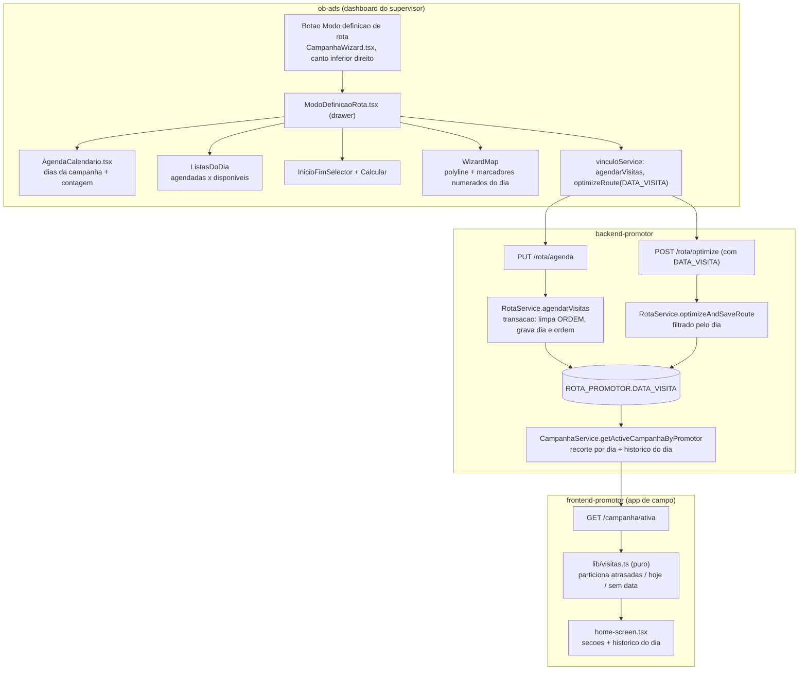

# Modo Definição de Rota com Agenda por Dia — Design

**Spec**: `.specs/features/modo-definicao-rota/spec.md`
**Context**: `.specs/features/modo-definicao-rota/context.md`
**Status**: Draft

---

## Conformidade com decisões de projeto

`AD-001` continua ativa e não é tocada: esta feature não muda como uma oficina se liga a um cliente,
só quando ela é visitada. **Conforma**.

Esta feature acrescenta uma decisão de nível de projeto, `AD-002`, registrada em
`.specs/STATE.md` ao fim do design: o dia planejado de uma visita vive em
`ROTA_PROMOTOR.DATA_VISITA`, e `ORDEM` passa a significar ordem dentro do dia.

Lições confirmadas aplicadas:

- **L-002** (`scope:routes`) — a rota `PUT /rota/agenda` monta `validateSchema`; ganha teste de
  integração próprio que exercita o middleware, não só o serviço.
- **L-004** (`scope:raw-sql`) — a query de `getActiveCampanhaByPromotor` muda de verdade (coluna
  nova, filtro de data, nova ordenação). Os testes que hoje alimentam linhas prontas ao mock não
  provam nada sobre o filtro, então os testes novos afirmam também o texto do SQL: a presença da
  coluna `DATA_VISITA` no `SELECT`, a conversão de fuso no recorte por `DONE_AT` e a cláusula
  `ORDER BY` por `DATA_VISITA`.

---

## Exploração de abordagens

### Onde o modo vive na tela

| Abordagem | Como funciona | Custo | Veredito |
|---|---|---|---|
| **A. Drawer lateral direito sobre o mapa** | Painel de 400px à direita, mapa continua visível e desenha o trajeto do dia | Espaço apertado para calendário mais duas listas | **Escolhida** — é o padrão que `OrdenacaoModal` já usa, o mapa segue sendo o palco, e o botão que abre o modo está justamente naquele canto |
| B. Substituir o conteúdo do painel esquerdo | O passo 3 troca a lista de promotores pelo modo | Perde a lista de promotores enquanto edita, e o botão do canto inferior direito fica longe do que ele abre | Descartada |
| C. Tela cheia própria fora do wizard | Rota nova `/campanha-para-promotores/rotas` | Tira o modo de perto do raio, que é o contexto que define quais oficinas existem | Descartada |

### Como o dia entra na ordenação existente

| Abordagem | Custo | Veredito |
|---|---|---|
| **A. `ORDEM` passa a ser por dia; rotas sem dia mantêm o significado atual** | Exige índice único parcial e escrita em duas fases | **Escolhida** — sem nenhuma rota agendada o comportamento é idêntico ao de hoje, que é a garantia de compatibilidade da spec |
| B. Coluna `ORDEM_DIA` separada, `ORDEM` intocada | Duas ordens convivendo, e todo leitor precisa saber qual vale | Descartada |
| C. Ordem implícita pelo `ID_ROTA_PROMOTOR` dentro do dia | Supervisor não conseguiria ordenar nada | Descartada |

---

## Architecture Overview



---

## Code Reuse Analysis

### Componentes existentes aproveitados

| Componente | Local | Como usar |
|---|---|---|
| `RouteOrderingSection` | `ob-ads/.../components/RouteOrderingSection.tsx` | Fonte das interações de arrastar, das setas de subir e descer e dos seletores de início e fim. O modo novo reimplementa essas partes dentro do próprio drawer; o arquivo antigo fica sem referência |
| `fetchOSRMRouteClient` | mesmo arquivo | Movido para `ob-ads/service/osrmService.ts` e reaproveitado pelo modo para desenhar o trajeto do dia |
| `optimizeRoute`, `reorderRotas` (cliente) | `ob-ads/service/vinculoService.ts` | `optimizeRoute` ganha o parâmetro de dia; `reorderRotas` continua como está |
| `RotaService.optimizeAndSaveRoute` | `backend-promotor/service/rotaService.ts` | Ganha filtro opcional por dia; o algoritmo de `utils/routeOptimizer.ts` não muda |
| `utils/routeOptimizer.ts` | mesmo repo | Nearest Neighbor com extremos fixos mais 2-opt, reaproveitado sem alteração |
| `createDocumentedRoute` | `backend-promotor/utils/routeDocumentation.ts` | Registro de `PUT /rota/agenda` |
| `WizardMap` | `ob-ads/.../components/wizard/WizardMap.tsx` | Ganha uma camada opcional de trajeto do dia; as camadas existentes de raio e oficinas não mudam |
| `wizard-theme.ts` | mesma pasta | Pele do drawer e do calendário |
| `haversine` | `frontend-promotor/lib/haversine.ts` | Continua ordenando apenas o grupo sem data |

### Pontos de integração

| Sistema | Integração |
|---|---|
| `GET /campanha/ativa` | Ganha `DATA_VISITA` por rota, `DATA_REFERENCIA` no envelope, e o recorte de visibilidade |
| `PUT /rota/reorder` | Ganha a guarda de 409 para proximidade com agenda ativa |
| Recálculo de raio | Sem mudança: a rota desativada leva junto sua `DATA_VISITA`, que some da agenda por consequência |
| `NOTIFICACAO_VISITA` | Nenhuma integração, por decisão da spec |

---

## Data Models

### Migration

`backend-promotor/scripts/migration-data-visita-rota.sql`, aplicada manualmente, no padrão dos
demais arquivos `migration-*.sql` deste repositório.

```sql
ALTER TABLE "CAMPANHAS_OB"."ROTA_PROMOTOR"
  ADD COLUMN IF NOT EXISTS "DATA_VISITA" DATE NULL;

CREATE INDEX IF NOT EXISTS idx_rota_promotor_data_visita
  ON "CAMPANHAS_OB"."ROTA_PROMOTOR" ("ID_CAMPANHA_PROMOTOR", "DATA_VISITA")
  WHERE "DELETED_AT" IS NULL;

CREATE UNIQUE INDEX IF NOT EXISTS uq_rota_promotor_dia_ordem
  ON "CAMPANHAS_OB"."ROTA_PROMOTOR" ("ID_CAMPANHA_PROMOTOR", "DATA_VISITA", "ORDEM")
  WHERE "DELETED_AT" IS NULL AND "DATA_VISITA" IS NOT NULL;
```

O índice único parcial é o que cumpre `AGENDA-06` no banco, não só no código.

### Entidade

```typescript
// entities/RotaPromotor.ts
@Column({ type: "date", nullable: true, name: "DATA_VISITA" })
DATA_VISITA?: string; // "YYYY-MM-DD" — TypeORM entrega `date` como string
```

### Contrato de `PUT /rota/agenda`

```typescript
interface AgendaVisitaBody {
  ID_CAMPANHA_PROMOTOR: number;
  /** "YYYY-MM-DD", ou null para desagendar as rotas de `rotas` */
  DATA: string | null;
  /** ordem desejada dentro do dia; posição no array vira ORDEM 1..N */
  rotas: number[];
  /** rotas que saem deste dia e voltam a ficar sem data */
  desagendar?: number[];
}
```

### Envelope de `GET /campanha/ativa`

```typescript
{
  ID_CAMPANHA: number;
  ESTRATEGIA_ORDENACAO: EstrategiaOrdenacao;
  /** "YYYY-MM-DD" de hoje em America/Sao_Paulo, calculado no servidor */
  DATA_REFERENCIA: string;
  rotas: Array<RotaAPI & { DATA_VISITA: string | null }>;
}
```

`DATA_REFERENCIA` existe para o app rotular uma visita como atrasada sem depender do relógio do
aparelho, e para a função pura de partição ser determinística no teste.

---

## Components

### `RotaService.agendarVisitas`

- **Purpose**: gravar o dia e a ordem de um conjunto de rotas, numa transação só.
- **Location**: `backend-promotor/service/rotaService.ts`
- **Interfaces**:
  - `agendarVisitas(idCampanhaPromotor: number, data: string | null, idsRota: number[], idsDesagendar?: number[]): Promise<AgendaResultado>`
- **Dependencies**: `AppDataSourceSync`, `CampanhaPromotor`, `Campanha`
- **Passos**:
  1. Carrega o vínculo com a campanha; sem campanha com `START_TIME` e `END_TIME`, responde 422.
  2. Se `data` não é nula, valida que cai no intervalo da campanha (`AGENDA-04`).
  3. Carrega as rotas pedidas; qualquer uma fora do vínculo, apagada, `FINALIZADO` ou `CANCELADO` aborta com 409 (`AGENDA-05`).
  4. Abre transação. **Primeiro zera `ORDEM`** de todas as rotas envolvidas, **depois** grava `DATA_VISITA` e `ORDEM` 1..N. As duas fases existem porque o índice único parcial não é adiável em Postgres: atualizar uma linha por vez sem zerar antes colidiria no meio do caminho.
  5. `desagendar` limpa `DATA_VISITA` e `ORDEM` das rotas listadas, dentro da mesma transação (`AGENDA-08`, `AGENDA-09`).
  6. Grava `ESTRATEGIA_ORDENACAO = MANUAL` no vínculo quando `data` não é nula.
- **Reuses**: repositórios já expostos por `getRotaRepo` e `getCampanhaPromotorRepo`

### `RotaService.optimizeAndSaveRoute` (estendido)

- **Purpose**: otimizar apenas as oficinas de um dia.
- **Location**: `backend-promotor/service/rotaService.ts`
- **Interfaces**:
  - `optimizeAndSaveRoute(idCampanhaPromotor: number, idOficinaInicio: number, idOficinaFim: number, dataVisita?: string | null)`
- **Mudanças**:
  - Quando `dataVisita` é informada, o `find` filtra por aquele dia (`OTIM-02`, `OTIM-05`).
  - A verificação de coordenadas passa a olhar só as rotas do recorte (`OTIM-07`).
  - A escrita de `ORDEM` passa pela mesma transação em duas fases de `agendarVisitas`.
  - Com `dataVisita` informada, `ID_OFICINA_INICIO` e `ID_OFICINA_FIM` do vínculo **não** são escritos: início e fim de um dia são derivados da menor e da maior `ORDEM` daquele dia (`OTIM-08`).
  - Sem `dataVisita`, o comportamento é exatamente o de hoje.
- **Reuses**: `optimizeRoute` e `fetchOSRMRoute` de `utils/routeOptimizer.ts`

### `RotaService.reorderRotas` (guarda nova)

- **Mudança**: antes de aplicar `PROXIMIDADE_PROMOTOR`, conta rotas do vínculo com `DATA_VISITA` não nula. Havendo qualquer uma, lança `AGENDA_ATIVA_IMPEDE_PROXIMIDADE`, que o controller traduz em 409 (`AGENDA-11`).
- **Motivo**: essa estratégia limpa `ORDEM` de todas as rotas de uma vez, o que apagaria a ordem de todos os dias.

### `CampanhaService.getActiveCampanhaByPromotor` (query estendida)

- **Location**: `backend-promotor/service/campanhaService.ts:260`
- **Mudanças na query bruta**:
  - `SELECT` ganha `rp."DATA_VISITA"`.
  - `WHERE` ganha o recorte de visibilidade:

```sql
AND (
  (rp."STATUS" IN ('FINALIZADO','CANCELADO')
     AND (rp."DONE_AT" AT TIME ZONE 'UTC' AT TIME ZONE 'America/Sao_Paulo')::date
         = (now() AT TIME ZONE 'America/Sao_Paulo')::date)
  OR
  (rp."STATUS" NOT IN ('FINALIZADO','CANCELADO')
     AND (rp."DATA_VISITA" IS NULL
          OR rp."DATA_VISITA" <= (now() AT TIME ZONE 'America/Sao_Paulo')::date))
)
```

  - `ORDER BY rp."DATA_VISITA" ASC NULLS LAST, rp."ORDEM" ASC NULLS LAST, rp."ID_ROTA_PROMOTOR" ASC`.
  - O retorno passa a incluir `DATA_REFERENCIA`, calculada com a mesma expressão de data.
- **Nota sobre fuso**: `DONE_AT` é `timestamp` sem fuso, e o app de campo grava `new Date().toISOString()`, ou seja, UTC. Por isso a conversão é de UTC para São Paulo, não uma interpretação direta. Ver Risks.

### `ModoDefinicaoRota.tsx`

- **Purpose**: drawer onde o supervisor monta a rota e a agenda de um promotor.
- **Location**: `ob-ads/.../components/wizard/ModoDefinicaoRota.tsx`
- **Interfaces**: `{ campanhaId: number; vinculo: WizardVinculo; campanha: Campanha; onClose: () => void; onRotaDiaChange: (r: RotaDia | null) => void }`
- **Estado local**: `Map<idRota, string | null>` com o dia de cada rota, inicializado do servidor. É esse mapa que sustenta `DIA-04` e `DIA-05` antes de qualquer salvamento, e `MODO-09` ao fechar sem salvar.
- **Dependencies**: `AgendaCalendario`, `vinculoService`, `osrmService`, `wizard-theme`
- **Reuses**: interações de arrastar e das setas, adaptadas de `RouteOrderingSection`

### `AgendaCalendario.tsx`

- **Purpose**: tira de dias do período da campanha com a contagem de visitas por dia.
- **Location**: mesma pasta
- **Interfaces**: `{ inicio: Date; fim: Date; selecionado: string; contagemPorDia: Record<string, number>; onSelect: (d: string) => void }`
- **Dependencies**: nenhuma biblioteca nova; a geração dos dias é uma função pura testável
- **Nota**: todos os dias do intervalo entram, fim de semana incluído (`DIA-02`)

### `WizardMap` (camada nova)

- **Purpose**: desenhar o trajeto do dia selecionado.
- **Interfaces**: prop nova `rotaDia?: { coordenadas: [number, number][]; geometry: GeoJSONLineString | null; cor: string }`
- **Comportamento**: uma `L.polyline` num grupo próprio, mais marcadores numerados nas oficinas do dia. Sem geometria do OSRM, desenha a ligação reta entre os pontos (`OTIM-06`).
- **Reuses**: o padrão de grupos de camadas separados que o arquivo já adota

### `lib/visitas.ts` (app de campo)

- **Purpose**: separar as visitas em atrasadas, de hoje e sem data, e ordená-las.
- **Location**: `frontend-promotor/lib/visitas.ts`
- **Interfaces**:
  - `particionarVisitas(rotas: RotaPromotor[], dataReferencia: string): { atrasadas: RotaPromotor[]; hoje: RotaPromotor[]; semData: RotaPromotor[] }`
  - `ordenarPendentes(particao, estrategia, userCoords): RotaPromotor[]`
- **Dependencies**: `haversine`
- **Por que um módulo puro**: o Jest de `frontend-promotor` roda em ambiente `node`, sem jsdom e sem
  React Testing Library. Só função pura é testável neste repositório, então toda a regra de `APP-07`
  a `APP-10` precisa morar fora do componente.

---

## Error Handling Strategy

| Cenário | Tratamento | O que o usuário vê |
|---|---|---|
| Data fora do período da campanha | 422 de `agendarVisitas` | Dia fica desabilitado no calendário; se escapar, mensagem de erro e lista intacta |
| Campanha sem `START_TIME` ou `END_TIME` | Calendário desabilitado no cliente, 422 no servidor | Aviso explicando que a campanha precisa de período |
| Rota já concluída ou cancelada no lote | 409, nada é gravado | Mensagem dizendo que há visita já concluída na seleção |
| Falha parcial na transação | Rollback completo | Lista permanece como estava e o motivo aparece |
| Proximidade com agenda ativa | 409 | Aviso de que a agenda por dia impede a ordenação por GPS |
| Oficina do dia sem coordenada | Erro identificando a oficina, nenhuma ordem alterada | Mensagem nomeando a oficina |
| OSRM indisponível | Ordem é persistida mesmo assim | Trajeto desenhado em linha reta, sem erro |
| Duas abas salvando o mesmo dia | Última escrita vence | Sem aviso; é a assumption registrada na spec |

---

## Risks & Concerns

| Concern | Location | Impact | Mitigation |
|---|---|---|---|
| `DONE_AT` é `timestamp` sem fuso e o recorte do histórico depende de saber em que fuso ele foi gravado | `entities/RotaPromotor.ts:57`, `frontend-promotor/service/rota.service.ts` | Se o valor não estiver em UTC, o histórico do dia pode cortar no horário errado | O app grava `toISOString()`, que é UTC, e a query converte explicitamente de UTC para São Paulo. Um teste de integração alimenta timestamps conhecidos nas bordas do dia e afirma o recorte |
| `optimizeAndSaveRoute` grava `ORDEM` numa linha por vez em laço | `service/rotaService.ts:385` | Com o índice único novo, uma atualização intermediária pode colidir com uma linha ainda não atualizada | Escrita em duas fases dentro de transação: zera `ORDEM` do recorte, depois grava 1..N |
| `reorderRotas` escreve `ID_OFICINA_INICIO` e `ID_OFICINA_FIM` como `undefined` sempre | `service/rotaService.ts:437` | Salvar uma ordem manual apaga o início e o fim gravados por uma otimização anterior | Comportamento herdado e mantido; o modo novo não depende desses campos, porque deriva início e fim da própria ordem do dia |
| Uma oficina pode ter rota ativa sob dois promotores da mesma campanha | `CONCERNS.md` RN-01 | A mesma oficina pode ser agendada duas vezes, uma por promotor, sem o sistema perceber | Fora de escopo por decisão da spec. Registrado aqui para não ser lido como regressão desta feature |
| `StepPromotores.tsx` é tocado pelas duas features desta rodada | `ob-ads/.../StepPromotores.tsx` | Conflito de edição se as duas forem implementadas em paralelo | Ordem de execução fixada: o importador primeiro, o modo depois |
| `RouteOrderingSection` e `OrdenacaoModal` ficam sem referência | `ob-ads/.../components/` | Código morto convidando a divergir | Remoção declarada fora de escopo na spec, para não inflar o diff. Fica registrado como dívida |
| Nenhum teste cobre hoje o recorte de rotas de `GET /campanha/ativa` | `__tests__/unit/campanhaService.test.ts` | A mudança de query passaria despercebida | Testes novos afirmam o texto do SQL além das linhas devolvidas, conforme L-004 |
| `frontend-promotor` não tem jsdom nem RTL | `frontend-promotor/jest.config.js` | Tentar testar o componente falharia por ambiente | A regra vive em `lib/visitas.ts` e é testada como função pura |

---

## Tech Decisions

| Decisão | Escolha | Rationale |
|---|---|---|
| Lugar do modo na tela | Drawer lateral direito sobre o mapa | Mantém o mapa como palco e nasce do próprio canto onde o botão vive |
| Unicidade de ordem por dia | Índice único parcial no banco | Garantia real, não apenas convenção no código |
| Escrita da ordem | Duas fases em transação | O índice único parcial não pode ser adiado em Postgres |
| Início e fim do dia | Derivados da menor e da maior `ORDEM` | Evita coluna nova para guardar o que a ordem já expressa |
| Recorte do que o promotor vê | Na query do backend | Uma regra num lugar só, e o app antigo já recebe o comportamento novo |
| Referência de "hoje" | Calculada no servidor e enviada como `DATA_REFERENCIA` | Deixa a partição determinística e independente do relógio do aparelho |
| Regra de exibição do app | Módulo puro `lib/visitas.ts` | É o único formato testável no ambiente de teste daquele repositório |
| Proximidade com agenda | Bloqueada com 409 | Alternar para proximidade apaga `ORDEM` de todo o vínculo |

> **Decisão de nível de projeto:** registrar `AD-002` em `.specs/STATE.md` — o dia planejado de uma
> visita vive em `ROTA_PROMOTOR.DATA_VISITA` e `ORDEM` passa a significar a ordem dentro do dia;
> qualquer feature futura de agendamento reaproveita essa coluna em vez de criar tabela nova.

---

## Matriz de cobertura de testes

| Requisito | Onde é testado |
|---|---|
| AGENDA-01, AGENDA-02 | `__tests__/unit/rotaServiceAgenda.test.ts` mais revisão da migration |
| AGENDA-03 a AGENDA-09 | `__tests__/unit/rotaServiceAgenda.test.ts` |
| AGENDA-06 | `__tests__/integration/rotaAgenda.test.ts`, incluindo a reordenação que colidiria sem as duas fases |
| AGENDA-10 | `__tests__/unit/rotaService.test.ts` existente, estendido |
| AGENDA-11 | `__tests__/unit/rotaServiceAgenda.test.ts` |
| Middleware de schema da rota nova | `__tests__/integration/rotaAgenda.test.ts` (L-002) |
| MODO-01 a MODO-04, MODO-10, MODO-11 | `ModoDefinicaoRota.test.jsx` e `StepPromotores.test.jsx` (RTL) |
| MODO-05 a MODO-09 | `ModoDefinicaoRota.test.jsx` |
| DIA-01, DIA-02 | `agendaCalendario.test.js` (pure) |
| DIA-03 a DIA-07, DIA-10 | `modoDefinicaoRotaState.test.js` (pure, sobre o mapa de dias) |
| DIA-08, DIA-09 | `ModoDefinicaoRota.test.jsx` |
| OTIM-01 a OTIM-08 | `__tests__/unit/rotaServiceOptimizeDia.test.ts` |
| OTIM-09 | `ModoDefinicaoRota.test.jsx` |
| APP-01 a APP-06 | `__tests__/unit/campanhaServiceVisitasDoDia.test.ts`, afirmando também o texto do SQL (L-004) |
| APP-07 a APP-11 | `frontend-promotor/lib/visitas.test.ts` (pure) |

---

## Ordem de execução entre as duas features

1. `importador-oficinas-de-para` — toca `StepPromotores.tsx` removendo dois botões e trocando o fluxo de import.
2. `modo-definicao-rota` — toca o mesmo arquivo removendo o botão de ordenar, e `CampanhaWizard.tsx`.

Invertendo a ordem, o segundo conjunto de tasks reescreveria trechos que o primeiro acabou de mexer.
