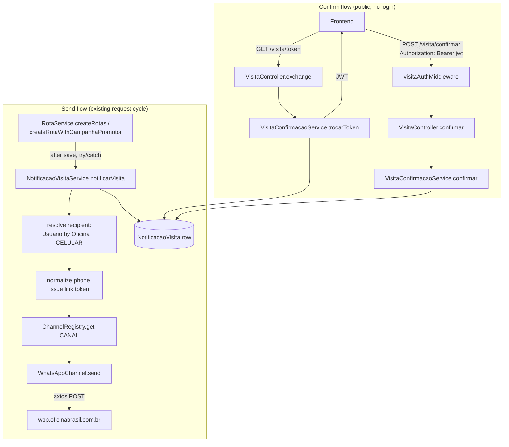

# Notificação de Visita e Confirmação do Reparador Design

**Spec**: `.specs/features/notificacao-visita-confirmacao/spec.md`
**Context**: `.specs/features/notificacao-visita-confirmacao/context.md`
**Frontend contract**: `.specs/features/notificacao-visita-confirmacao/frontend-contract.md`
**Status**: Draft

---

## Architecture Overview

Two independent flows sharing one entity (`NotificacaoVisita`):

1. **Send flow** (synchronous, inside the existing route-creation request): `RotaService` creates a `RotaPromotor` row, then calls the notification orchestrator, which resolves a recipient, normalizes their phone, issues a link token, and dispatches through a channel registry (WhatsApp today, extensible later). Failure at any step is caught and recorded as `FALHOU` — it never fails the route-creation response.
2. **Confirm flow** (two public HTTP calls, no login): the frontend exchanges the WhatsApp link's token for a short-lived JWT (`GET /visita/{token}`), then submits confirmation with that JWT (`POST /visita/confirmar`).



---

## Code Reuse Analysis

### Existing Components to Leverage

| Component | Location | How to Use |
| --- | --- | --- |
| `createDocumentedRoute` | `utils/routeDocumentation.ts` | Wire `GET /visita/:token` and `POST /visita/confirmar` the same way all 6 existing domains do — Zod schema validation + OpenAPI registration in one call. |
| Static-class service pattern | `service/*.ts` | `NotificacaoVisitaService` and `VisitaConfirmacaoService` follow the same `export default class X { static async method() }` shape as `RotaService`, `PromotorService`. |
| `jsonwebtoken` + `JWT_SECRET` | `controllers/promotorController.ts:164`, `.env` | Reuse the library and secret for signing/verifying the visit JWT — **not** the payload shape (see Risks). |
| Node `crypto` | `utils/encryption.ts` | `crypto.randomBytes` for the opaque link token, `crypto.createHash('sha256')` for hashing it before storage — same primitives already used for password encryption in this codebase. |
| Envelope response shape | all `controllers/*.ts` | `{ message, data }` on success, `{ message, error }` on failure — `VisitaController` follows the same shape (P2 AC2 explicitly requires this). |
| Raw-SQL migration convention | `scripts/migration-ordenacao-rotas.sql` | New table ships as `scripts/migration-notificacao-visita.sql` — this project has no TypeORM `synchronize`/migrations wired up (`data-source.ts`), so this is the only way schema changes land. |
| axios (installed, unused) | `package.json` | First real usage in this codebase (`INTEGRATIONS.md` confirms zero existing HTTP client call sites) — used for the WhatsApp `send-template` call. |

### Integration Points

| System | Integration Method |
| --- | --- |
| `RotaService.createRotas`, `createRotaWithCampanhaPromotor`, **and `updateRotaWorkshops`** | Add one `await NotificacaoVisitaService.notificarVisita(rota)` call per created `RotaPromotor`, after `save`/`saveMany`, inside a try/catch that only logs — never rethrows (belt-and-suspenders on top of `notificarVisita`'s own internal catch). **All three** are creation paths: `updateRotaWorkshops` (`service/rotaService.ts:139-152`) creates rows for newly-added workshops via `repo.saveMany(novasRotas)`, so spec AC1 ("WHEN a new `RotaPromotor` record is created") covers it too. Missing it would leave routes added by editing a campaign silently un-notified. |
| `wpp.oficinabrasil.com.br` | New outbound HTTP integration via axios; `POST /api/v1/messages/send-template`, `Authorization: Bearer {WHATSAPP_API_KEY}`. |
| `CAMPANHAS_OB` schema (owned, writable — same as `RotaPromotor`) | New table `NOTIFICACAO_VISITA`, written only through `AppDataSourceSync` — no `MigrationAwareRepository` needed, this is new data with no legacy counterpart. |
| `MAIN_REGISTER.USUARIO` (read-only) | `NotificacaoVisitaService` reads `Usuario` rows (via `AppDataSourceSync`, same cross-schema access `RotaPromotor`→`Oficina` already does) to resolve the recipient; never writes to it. |

---

## Components

### `entities/NotificacaoVisita.ts`

- **Purpose**: TypeORM entity for the notification/confirmation lifecycle, one row per `RotaPromotor`.
- **Location**: `entities/NotificacaoVisita.ts`
- **Reuses**: Same decorator style as `entities/RotaPromotor.ts` (enum columns, `@CreateDateColumn`/`@UpdateDateColumn`, `@ManyToOne` + `@JoinColumn`).
- See Data Models below for fields.

### `service/notificacaoVisitaService.ts`

- **Purpose**: Owns the send flow — recipient resolution, phone normalization, token issuance, dispatch. Never throws; every failure path resolves to a `FALHOU` row instead, so the caller (`RotaService`) can't be broken by it even without its own try/catch.
- **Location**: `service/notificacaoVisitaService.ts`
- **Interfaces**:
  - `notificarVisita(rota: RotaPromotor): Promise<NotificacaoVisita>` — full send flow (NOTIF-01–03, 05–13, 22, 23). Returns the final row regardless of outcome.
- **Dependencies**: `entities/NotificacaoVisita`, `entities/Usuario`, `utils/visitaToken`, `channels/channelRegistry`, `AppDataSourceSync`.
- **Reuses**: Static-class pattern, direct `AppDataSourceSync.getRepository()` access (same as `RotaService`'s non-`MigrationAwareRepository` methods).

### `service/envioGuards.ts`

- **Purpose**: The three pre-send guards (NOTIF-27–30) that decide whether a notification is sent at all, kept out of `notificacaoVisitaService` so the "should we send?" policy is independently testable from the "how do we send?" mechanics.
- **Location**: `service/envioGuards.ts`
- **Interfaces**:
  - `enderecoRecente(oficina: Pick<Oficina, "DATA_ALTERACAO">, agora?: Date): boolean` — true when `DATA_ALTERACAO` is within 3 months. **NULL counts as stale**, never fresh (spec edge case).
  - `avaliarGuardas(idUsuario: number, agora?: Date): Promise<{ bloqueado: boolean; motivo?: string }>` — runs the opportunistic `EXPIRADO` persist first (NOTIF-30), then checks outstanding (NOTIF-28) and recently-confirmed (NOTIF-29) for that `Usuario`.
- **Order matters**: the `EXPIRADO` write must happen *before* the outstanding check, or a just-expired row would falsely block a legitimate send.
- **Dependencies**: `entities/NotificacaoVisita`, `AppDataSourceSync`, injectable clock for tests.
- **Reuses**: Static-class/module pattern; `AppDataSourceSync.getRepository()` directly.

### `channels/ChannelSender.ts` + `channels/channelRegistry.ts` + `channels/whatsappChannel.ts`

- **Purpose**: The "camada de canais" (CON26-82) — a small interface plus a registry keyed by the `CANAL` enum, so a future channel (SMS/email) is one new file + one registry entry, not a call-site change.
- **Location**: `channels/`
- **Interfaces**:
  - `ChannelSender.send(params: { toPhone: string; variables: string[] }): Promise<ChannelSendResult>`
  - `getChannel(canal: CanalNotificacao): ChannelSender` (registry lookup, throws only on an unregistered enum value — a programmer error, not a runtime/config one)
  - `WhatsAppChannel.send(...)` — implements the interface; normalizes phone (NOTIF-06), calls axios, maps provider error codes (NOTIF-08, NOTIF-21), and self-gates on `WHATSAPP_SEND_ENABLED`/`NODE_ENV` (NOTIF-22, NOTIF-23) so the lock lives with the one class that can actually make the call, not scattered across callers.
- **Dependencies**: `axios`, `WHATSAPP_*` env vars.
- **Reuses**: Nothing existing — this is the first outbound HTTP client in the codebase; kept isolated to one file so it's easy to review/swap.

### `utils/visitaToken.ts`

- **Purpose**: Everything token/JWT-shaped for this feature, kept separate from `utils/encryption.ts` (different purpose: link tokens + scoped JWTs, not password-at-rest encryption).
- **Location**: `utils/visitaToken.ts`
- **Interfaces**:
  - `gerarLinkToken(): { raw: string; hash: string }` — `crypto.randomBytes(32)` → base64url for `raw`, SHA-256 hex of `raw` for `hash`. Only `hash` is ever persisted.
  - `hashToken(raw: string): string`
  - `emitirJwt(payload: { sub: number; notificacaoVisitaId: number; rotaPromotorId: number; scope: "visita:confirmar" }): string` — `jsonwebtoken.sign(..., JWT_SECRET, { expiresIn: "30m" })`.
  - `verificarJwt(token: string): VisitaJwtPayload` — `jsonwebtoken.verify` + Zod-parse the payload shape; throws on any failure (caught by the middleware).
- **Dependencies**: `jsonwebtoken`, `JWT_SECRET`, `zod`, Node `crypto`.
- **Reuses**: Library and secret from the promoter-login flow; deliberately its own payload schema (see Risks — `authMiddleware`'s schema is a known mismatch, not something to inherit).

### `utils/statusNotificacaoVisita.ts`

- **Purpose**: The single source of truth for a notification's *effective* status (NOTIF-17 / AC22). Expiry is derived here, never written by a transition — see Tech Decisions.
- **Location**: `utils/statusNotificacaoVisita.ts`
- **Interfaces**:
  - `statusEfetivo(n: Pick<NotificacaoVisita, "STATUS" | "EXPIRA_EM">, agora = new Date()): StatusNotificacaoVisita` — returns `EXPIRADO` when `STATUS === 'ENVIADO' && EXPIRA_EM != null && EXPIRA_EM < agora`; otherwise returns `STATUS` unchanged. Injectable clock so expiry-boundary tests don't depend on wall time.
- **Dependencies**: none beyond the entity's types — a pure function, trivially unit-testable.
- **Used by**: `VisitaConfirmacaoService.trocarToken`, `VisitaConfirmacaoService.confirmar`, and every read path in the NOTIF-19 component below.
- **Note**: this helper is the one thing that must not be bypassed. Any read path that returns `STATUS` straight off the entity reintroduces the staleness bug — worth an explicit test asserting the dashboard path reports `EXPIRADO` for an unopened expired row.

### `service/visitaConfirmacaoService.ts`

- **Purpose**: Owns the confirm flow — token exchange and the confirm action itself.
- **Location**: `service/visitaConfirmacaoService.ts`
- **Interfaces**:
  - `trocarToken(rawToken: string): Promise<ExchangeResult>` — hashes `rawToken`, looks up `NotificacaoVisita`, branches on `statusEfetivo()` (NOTIF-11, 14–18, 24) into `PENDING` (issues JWT) / `ALREADY_CONFIRMED` / `EXPIRED` / `TOKEN_INVALID`.
  - `confirmar(jwtPayload: VisitaJwtPayload, ip: string): Promise<ConfirmResult>` — re-checks live state (not the JWT's stale snapshot), atomically transitions `ENVIADO`→`CONFIRMADO` via a conditional `UPDATE ... WHERE STATUS = 'ENVIADO' AND "EXPIRA_EM" > now()` (NOTIF-12, 19–21, 25), sets `CONFIRMADO_EM`/`CONFIRMADO_POR`/`CONFIRMADO_IP`. On `rowCount = 0`, re-reads the row and returns `ALREADY_CONFIRMED` or `EXPIRED` accordingly.
  - `atualizarEndereco(jwtPayload: VisitaJwtPayload, endereco: EnderecoInput, ip: string): Promise<ConfirmResult>` — validates the payload against the address-column allowlist (NOTIF-32), updates only those columns on `MAIN_REGISTER.OFICINA`, then applies the same `CONFIRMADO` transition as `confirmar` plus `ENDERECO_ATUALIZADO = true` (NOTIF-31). **Ordering: the `Oficina` write happens first and must succeed** — if it fails (including a missing `UPDATE` grant), the notification STATUS is left untouched and a distinct error is returned, never a false confirmation (NOTIF-33).
- **Dependencies**: `entities/NotificacaoVisita`, `entities/Oficina`, `utils/visitaToken`, `utils/statusNotificacaoVisita`, `AppDataSourceSync`.
- **Reuses**: Static-class pattern.
- **Note**: `atualizarEndereco` is the only write to `MAIN_REGISTER` in this codebase — see Risks.

### `middlewares/visitaAuthMiddleware.ts`

- **Purpose**: Verifies the visit-scoped JWT on `POST /visita/confirmar` (and the future `POST /visita/reagendar`).
- **Location**: `middlewares/visitaAuthMiddleware.ts`
- **Interfaces**: `visitaAuthMiddleware(req, res, next)` — Express middleware, attaches `req.visitaJwt` on success.
- **Dependencies**: `utils/visitaToken.verificarJwt`.
- **Reuses**: Structurally mirrors `middlewares/authMiddleware.ts` (header parsing, 401/403 split) but with its **own** payload schema — see Risks for why it doesn't import the existing one.

### Status exposure on existing rota reads (NOTIF-19 / P2)

- **Purpose**: Surface each route's confirmation status to the ops dashboard and the promoter app, per P2 AC1/AC2. This is the one requirement that modifies existing code rather than adding new files.
- **Location**: `entities/RotaPromotor.ts`, `service/rotaService.ts`, `schemas/rota.ts`
- **Changes**:
  - Add the inverse relation on `RotaPromotor`: `@OneToOne(() => NotificacaoVisita, n => n.rotaPromotor) notificacaoVisita?: NotificacaoVisita`.
  - `RotaService.getRotaByIdWithRelations` (`service/rotaService.ts:201`) — add `'notificacaoVisita'` to its existing `relations` array. No query restructuring; it already eager-loads 4 relations this way.
  - Route-list reads used by the promoter app — include the same relation so each route carries its status.
  - Extend the response schemas in `schemas/rota.ts` so the added fields appear in the OpenAPI contract, matching how every other field there is declared.
- **Response shape**: status travels as a nested object on each route inside the existing `{ message, data }` envelope — no new top-level shape, as P2 AC2 requires.
- **Must use `statusEfetivo()`**: these read paths return the *derived* status, never the raw `STATUS` column — otherwise a link that expired unopened is reported as still live (AC22).
- **Reuses**: The existing `relations`-array loading pattern and `schemas/rota.ts` conventions.

### `controllers/visitaController.ts` + `routes/VisitaRoute.ts` + `schemas/visita.ts`

- **Purpose**: HTTP wiring, following the exact pattern of `rotaController.ts`/`RotaRoute.ts`/`schemas/rota.ts`.
- **Location**: `controllers/visitaController.ts`, `routes/VisitaRoute.ts`, `schemas/visita.ts`
- **Interfaces**:
  - `VisitaController.exchange(req, res)` — `GET /visita/:token`
  - `VisitaController.confirmar(req, res)` — `POST /visita/confirmar`
- **Dependencies**: `createDocumentedRoute`, `express-rate-limit` with a per-visit `keyGenerator` (see Tech Decisions — keyed on the token/JWT claim, never `req.ip`), `visitaAuthMiddleware` (confirm route only).
- **Mounted**: `app.use("/visita", visitaRoutes)` added to `api.ts` alongside the existing 6 domains.

---

## Data Models

### `NotificacaoVisita` (new entity, schema `CAMPANHAS_OB`, table `NOTIFICACAO_VISITA`)

```typescript
enum CanalNotificacao {
  WHATSAPP = "WHATSAPP",
}

enum StatusNotificacaoVisita {
  PENDENTE = "PENDENTE",
  ENVIADO = "ENVIADO",
  FALHOU = "FALHOU",     // something went wrong
  DISPENSADO = "DISPENSADO", // deliberately not sent (anti-spam / fresh address) — NOT a failure
  CONFIRMADO = "CONFIRMADO",
  EXPIRADO = "EXPIRADO",
  REAGENDADO = "REAGENDADO", // reserved — NOTIF-26, no code path sets/reads this yet
}

interface NotificacaoVisita {
  ID_NOTIFICACAO_VISITA: number;        // PK
  ID_ROTA_PROMOTOR: number;             // FK -> ROTA_PROMOTOR, UNIQUE (one row per route)
  ID_USUARIO: number | null;            // resolved recipient; NULL until AC2 resolves one, stays NULL on the AC3 "no recipient" path
  CANAL: CanalNotificacao;
  STATUS: StatusNotificacaoVisita;
  TELEFONE_NORMALIZADO: string | null;  // digits-only, 55DDDNNNNNNNNN
  TOKEN_HASH: string | null;            // SHA-256 hex of the link token; NULL until AC5 issues one. Raw token never persisted
  EXPIRA_EM: Date | null;               // token issuance time + 48h; NULL until AC5
  ERRO_ENVIO: string | null;            // provider error code / internal reason
  MESSAGE_ID: string | null;            // provider response
  PROVIDER_MESSAGE_ID: string | null;   // provider "wamid.xxx"
  ENVIADO_EM: Date | null;
  CONFIRMADO_EM: Date | null;
  CONFIRMADO_POR: number | null;        // = ID_USUARIO at confirm time (JWT subject, not re-authenticated)
  CONFIRMADO_IP: string | null;
  ENDERECO_ATUALIZADO: boolean;         // true when the reparador corrected the address rather than confirming it as-is (NOTIF-32)
  CREATED_AT: Date;
  UPDATED_AT: Date;
}
```

**Relationships**: `@ManyToOne` → `RotaPromotor` (unique `ID_ROTA_PROMOTOR`, enforces NOTIF-09's one-notification-per-route rule at the DB level, not just in application code). `ID_USUARIO` stored as a plain FK-shaped int column (no `@ManyToOne` to `Usuario` required — `Usuario` lives in `MAIN_REGISTER`, read-only, same cross-schema pattern `RotaPromotor` already uses for `Oficina`).

**Migration** (`scripts/migration-notificacao-visita.sql`, matching the existing raw-SQL convention):

```sql
CREATE TABLE IF NOT EXISTS "CAMPANHAS_OB"."NOTIFICACAO_VISITA" (
  "ID_NOTIFICACAO_VISITA" SERIAL PRIMARY KEY,
  "ID_ROTA_PROMOTOR" INT NOT NULL UNIQUE REFERENCES "CAMPANHAS_OB"."ROTA_PROMOTOR"("ID_ROTA_PROMOTOR"),
  -- ID_USUARIO / TOKEN_HASH / EXPIRA_EM are deliberately nullable: the row is INSERTed in
  -- PENDENTE (AC1) before a recipient is resolved (AC2) or a token issued (AC5), and the
  -- AC3 "no recipient with phone" path must be able to persist a FALHOU row with none of them.
  "ID_USUARIO" INT,
  "CANAL" VARCHAR(20) NOT NULL DEFAULT 'WHATSAPP',
  "STATUS" VARCHAR(20) NOT NULL DEFAULT 'PENDENTE',
  "TELEFONE_NORMALIZADO" VARCHAR(20),
  "TOKEN_HASH" VARCHAR(64),
  "EXPIRA_EM" TIMESTAMP,
  "ERRO_ENVIO" TEXT,
  "MESSAGE_ID" VARCHAR(100),
  "PROVIDER_MESSAGE_ID" VARCHAR(100),
  "ENVIADO_EM" TIMESTAMP,
  "CONFIRMADO_EM" TIMESTAMP,
  "CONFIRMADO_POR" INT,
  "CONFIRMADO_IP" VARCHAR(45),
  "ENDERECO_ATUALIZADO" BOOLEAN NOT NULL DEFAULT FALSE,
  "CREATED_AT" TIMESTAMP NOT NULL DEFAULT CURRENT_TIMESTAMP,
  "UPDATED_AT" TIMESTAMP NOT NULL DEFAULT CURRENT_TIMESTAMP
);

-- Supports the per-recipient anti-spam scan (NOTIF-28/29/30), which filters by
-- ID_USUARIO and STATUS on every route creation.
CREATE INDEX IF NOT EXISTS "IDX_NOTIFICACAO_VISITA_USUARIO_STATUS"
  ON "CAMPANHAS_OB"."NOTIFICACAO_VISITA" ("ID_USUARIO", "STATUS");

-- UNIQUE: TOKEN_HASH is the single-row lookup key for the exchange endpoint.
-- Postgres treats NULLs as distinct, so the nullable column above still allows
-- many un-issued (PENDENTE/FALHOU) rows to coexist.
CREATE UNIQUE INDEX IF NOT EXISTS "IDX_NOTIFICACAO_VISITA_TOKEN_HASH"
  ON "CAMPANHAS_OB"."NOTIFICACAO_VISITA" ("TOKEN_HASH");
```

**Write sequence** (two writes, matching the AC ordering): `INSERT` the row in `PENDENTE` with only `ID_ROTA_PROMOTOR`/`CANAL` set (AC1) → resolve recipient, normalize phone, issue token → `UPDATE` with `ID_USUARIO`, `TELEFONE_NORMALIZADO`, `TOKEN_HASH`, `EXPIRA_EM` (AC2, AC4, AC5) → `UPDATE` again with the dispatch outcome (AC7–AC9, AC11–AC13). Any failure short-circuits to an `UPDATE` setting `FALHOU` + `ERRO_ENVIO`.

---

## Error Handling Strategy

| Error Scenario | Handling | User/Frontend Impact |
| --- | --- | --- |
| No `Usuario` with phone under the Oficina | `notificarVisita` catches internally, sets `FALHOU` / `"no recipient with phone"` | None visible — route creation succeeds silently for this concern |
| Invalid/malformed `CELULAR` | Same as above, `"invalid phone"` | None visible |
| `WHATSAPP_SEND_ENABLED` off, or `NODE_ENV=test` | `WhatsAppChannel.send` short-circuits, logs payload, returns `FALHOU`/`"channel not configured"` — no HTTP call made | None visible; test runs never hit the network |
| `WHATSAPP_ACCOUNT_ID`/`WHATSAPP_TEMPLATE_NAME_VISITA` unset | Same no-op path | None visible |
| Provider 401/403/404 (token/account/template errors) | `FALHOU`/`"channel not configured"` + provider code in `ERRO_ENVIO` | None visible (recipient never got a message to click) |
| Provider 429 (`RATE_LIMITED`/`QUOTA_EXCEEDED`) | `FALHOU` + code in `ERRO_ENVIO`, no retry | None visible |
| Network failure calling `wpp.oficinabrasil.com.br` | Caught in `WhatsAppChannel.send`, same as a documented error response | None visible |
| `GET /visita/{token}` — malformed/unknown token | `404` `{ message, error: "TOKEN_INVALID" }` | Frontend renders "Link inválido" |
| `GET /visita/{token}` — expired | `410` `{ message, error: "EXPIRED" }`. Status is *derived* via `statusEfetivo()`; the stored `STATUS` column is not mutated by this read | Frontend renders "Este link expirou" |
| `GET /visita/{token}` — already confirmed | `200`, `data.state = "ALREADY_CONFIRMED"`, no JWT issued | Frontend renders "Você já confirmou..." |
| `POST /visita/confirmar` — JWT expired/invalid/wrong scope | `401`/`403` | Frontend silently re-exchanges via `GET`, retries once |
| `POST /visita/confirmar` — concurrent double-confirm | Conditional `UPDATE ... WHERE STATUS='ENVIADO'` affects 0 rows on the loser; loser's request re-reads STATUS and returns `409`/`ALREADY_CONFIRMED` | Frontend renders "Você já confirmou..." |
| Unexpected 500 anywhere in `/visita/*` | Standard envelope `{ message, error }`, logged via `console.error` | Frontend shows generic error + manual retry |

---

## Risks & Concerns

| Concern | Location | Impact | Mitigation |
| --- | --- | --- | --- |
| `authMiddleware.ts`'s JWT payload schema doesn't match what any current login issues (STATE.md risk #4) | `middlewares/authMiddleware.ts:17-20` | Reusing it for this feature would silently break confirm on day one | Don't reuse it — `visitaAuthMiddleware.ts` has its own payload schema, verified independently |
| Test suite currently broken (31/41 failing) — `__mocks__/data-source.ts` doesn't export `isLegacyEnabled`/`LegacyDataSource` | `__mocks__/data-source.ts` (per STATE.md) | This feature's new tests can pass in isolation, but a full green `npm test` run needs the pre-existing mock fixed first — not caused by this feature, but blocks a clean CI signal at Execute | Flag to user before Execute; this feature's tests should mock only what they need and not assume the global mock is fixed |
| No route in this entire codebase has authentication mounted (STATE.md risk #1) | `middlewares/authMiddleware.ts` (unmounted everywhere) | Not a regression this feature introduces — but worth noting `/visita/confirmar` will be the *first* route in this codebase with any request-level auth check at all | None needed — this feature's endpoints are intentionally public-by-design at the exchange step, then JWT-gated for the mutating action, which is stricter than everything else in this app today |
| `express-rate-limit`'s default store is in-memory, per-process | New dependency, `routes/VisitaRoute.ts` | If this service ever runs as >1 ECS task, the 20 req/min per-visit limit is per-task, not global — an attacker could get ~20×N req/min against one link | Acceptable for MVP (single task today per `task_definition.tpl.json`); documented so it's a conscious choice if the service scales out later |
| `app.ts` never sets `trust proxy`, so `req.ip` is the ALB address, not the client | `app.ts:10-12` | Any IP-keyed logic in this codebase is silently wrong behind the public endpoint. This feature routes around it (per-visit rate-limit key; `CONFIRMADO_IP` documented as best-effort) rather than changing global app config | Routed around, not fixed — noted here because the same trap will bite any future feature that assumes `req.ip` is the caller. Fixing it properly is a one-line `app.set('trust proxy', 1)` plus a review of anything already reading `req.ip` |
| No volumetric/DoS protection on the new public endpoints | `routes/VisitaRoute.ts` | Per-visit keying bounds abuse of any *single* link, but not a flood of requests with distinct/garbage tokens | Accepted: token entropy (256 bits) makes guessing infeasible, so the residual risk is bandwidth/DB load, which belongs at the ALB/WAF layer rather than in application code |
| First-ever outbound HTTP client in this codebase (`INTEGRATIONS.md` confirms zero prior usage) | `channels/whatsappChannel.ts` | No established timeout/retry convention to follow | Set an explicit axios timeout (e.g. 10s) so a hung provider can't hang the route-creation request; no retry, per spec's Out of Scope |
| `WHATSAPP_TEMPLATE_NAME_VISITA` / `WHATSAPP_ACCOUNT_ID` not yet provisioned (per spec.md Out of Scope) | Business-side, `wpp.oficinabrasil.com.br` dashboard | Feature ships functionally complete but silently no-ops on real sends until these are set | Already documented in spec.md; `.env.example` already has placeholders for both |
| **`UPDATE` grant on `MAIN_REGISTER.OFICINA` is unverified** — nothing in this codebase has ever written to that schema (`usuarioService.getUserById` is the only access and it reads) | `service/visitaConfirmacaoService.ts` → `MAIN_REGISTER.OFICINA` | If the app's DB user lacks the grant, every address correction fails at runtime — discovered only in production unless checked first | **Gate, not an assumption**: the task that implements `atualizarEndereco` must verify the grant against a real database before being marked done. NOTIF-33 ensures a failed write never reports a false confirmation, so the failure mode is a visible error rather than silent data loss |
| A link-holder can alter master registry data other systems consume | `service/visitaConfirmacaoService.ts` | Anyone with the WhatsApp link (forwarded, screenshotted, leaked) can change a workshop's address; there is no ops review step (user's explicit call) | Bounded by three limits: the JWT is scoped to one visit, only allowlisted address columns are writable (NOTIF-32), and every change is audited on the `NotificacaoVisita` row (`CONFIRMADO_POR`, `CONFIRMADO_IP`, `ENDERECO_ATUALIZADO`). Residual risk accepted by the user |
| Address edits leave `LATITUDE`/`LONGITUDE` stale | `entities/Oficina.ts` | A workshop that actually moved keeps its old coordinates, so `findNearestOficinas` and route optimization route to the old location | No geocoding provider exists in this codebase to fix it here (`getGeolocationDataByCep` reads the DB, not an external API). Documented in spec Out of Scope + Edge Cases as a known consequence; re-geocoding is follow-up work |
| Anti-spam guard adds a per-recipient query to every route creation | `service/envioGuards.ts` | Batch route creation runs the scan once per route, so an N-workshop batch does N scans inside the request cycle | Covered by the `(ID_USUARIO, STATUS)` index; volumes here are small (`STATE.md` notes <5k records overall). Revisit if batch sizes grow |

> No concerns found beyond the above in the areas this feature touches.

---

## Tech Decisions

| Decision | Choice | Rationale |
| --- | --- | --- |
| Link token storage | Store only `TOKEN_HASH` (SHA-256), never the raw token | A DB read/leak shouldn't hand out usable confirmation links; verification is a cheap deterministic hash-and-compare, no need for slow password-style hashing since the token itself already has 256 bits of entropy |
| HTTP client for WhatsApp | `axios` | Already a dependency, unused everywhere else — avoids adding yet another HTTP lib when 3 (`axios`, `undici`, `node-fetch`) already sit unused in `package.json` |
| Rate limiting | `express-rate-limit` with a custom `keyGenerator` — the link token on `GET`, the JWT's `ID_NOTIFICACAO_VISITA` on `POST`. **Not** IP-keyed | `app.ts` sets no `trust proxy`, so `req.ip` is the ALB's address behind the public endpoint — an IP key would put every caller in one shared bucket and lock out all users after 20 req/min service-wide. A per-visit key matches the real abuse shape (hammering one link) and is immune to the proxy problem entirely. In-memory store retained: no Redis in this stack |
| `CONFIRMADO_IP` | Recorded best-effort from `req.ip`, documented as the ALB address rather than the confirmer's | Same `trust proxy` root cause. Kept because it costs nothing and still separates internal from external origin — but it is not a trustworthy identity signal, and the design must not imply otherwise |
| Effective `EXPIRADO` status | Derived at read time by one shared helper, not stored by a transition | Nothing sweeps expired rows (no scheduler in this codebase), so a stored flip would only fire when a link was opened — leaving unopened expired links reported as live forever |
| Channel abstraction | Registry/factory (`Map<CanalNotificacao, ChannelSender>`) over one hardcoded WhatsApp class | Matches what CON26-82 ("camada de canais") actually asked for; the entity already has a `CANAL` column, so the registry key already exists in the data model |
| JWT verification | New `visitaAuthMiddleware.ts`, not a reuse of `authMiddleware.ts` | `authMiddleware`'s payload schema is already known-mismatched (STATE.md risk #4) — inheriting it would import a bug, not reuse working code |
| `NotificacaoVisita` persistence | `AppDataSourceSync` directly, no `MigrationAwareRepository` | This is new data with no legacy-DB counterpart to merge against — the dual-datasource wrapper exists specifically for data that predates the migration; nothing here does |
| Orchestrator hook | Direct synchronous call from `RotaService`, wrapped in try/catch, `notificarVisita` itself never throws | Matches this codebase's existing convention of services calling each other directly (no event bus/queue exists anywhere) — simplest thing that satisfies NOTIF-07/10 without new infrastructure |
| Atomic confirm transition | Conditional `UPDATE NOTIFICACAO_VISITA SET STATUS='CONFIRMADO', ... WHERE ID_NOTIFICACAO_VISITA = $1 AND STATUS='ENVIADO' AND "EXPIRA_EM" > now()`, check `rowCount` | Standard optimistic-concurrency pattern; avoids a `SELECT ... FOR UPDATE` for a single-row guarded update — matches this codebase's preference for raw SQL on anything non-trivial (`rotaService.ts`, `oficinaService.ts`). **The `EXPIRA_EM` guard is required, not decorative**: because expiry is derived rather than stored, an expired row still reads `STATUS='ENVIADO'` in the database — a `STATUS`-only guard would let a JWT issued before expiry confirm a dead visit, violating the spec's own edge case on exactly that scenario |

> No project-level convention is being set here beyond what's already true of this codebase — nothing added to `.specs/project/STATE.md` Decisions.

---

## Open Items Carried From Spec

Per `spec.md`'s Assumptions table, these remain unconfirmed and could still shift this design before Tasks:

- JWT expiry (30 min, assumed)
- Template variable order (`[oficinaNome, confirmationUrl]`, assumed — depends on the real approved WhatsApp template once created)
- Recipient tiebreak via `DATA_ALTERACAO` (accepted with the caveat that it's not an auto-maintained column)

## Design Review Log

A review pass over this document's first draft found six issues; all are resolved above. Recorded so the reasoning isn't lost:

1. **`ID_USUARIO` / `TOKEN_HASH` / `EXPIRA_EM` were `NOT NULL`** — unsatisfiable, since the row is inserted in `PENDENTE` before a recipient or token exists, and the `FALHOU`/"no recipient" path never produces them at all. The very first `INSERT` would have failed, and the failure the spec asks us to record was the one the schema forbade. Now nullable, with the write sequence documented.
2. **`req.ip` is the ALB, not the client** (`app.ts` sets no `trust proxy`). An IP-keyed rate limit would have been a service-wide lockout after 20 req/min, not a per-caller limit. Resolved by keying per visit; `CONFIRMADO_IP` demoted to best-effort. Spec AC25 and its assumption row updated to match.
3. **`updateRotaWorkshops` is a third route-creation path** (`service/rotaService.ts:139-152`) that the first draft missed — routes added by editing a campaign would never have notified.
4. **NOTIF-19 (P2 dashboard/app status) had no component at all** — one of 26 requirements was entirely undesigned. Now specified against the real read methods.
5. **`EXPIRADO` would never fire for unopened links**, so the dashboard would report expired visits as live indefinitely (nothing sweeps them; no scheduler exists). Resolved by deriving status at read time via a shared helper. Spec AC17/AC22 rewritten from a stored transition to a derived one.
6. **Knock-on from #5**: because expiry is now derived, an expired row still reads `STATUS='ENVIADO'` in the database — so the atomic confirm guard needed an explicit `AND "EXPIRA_EM" > now()`. Without it, a JWT issued before expiry could confirm a dead visit, contradicting the spec's own edge case.

Minor fixes in the same pass: `notifyVisitaSafe` (a method that existed nowhere) renamed to the real `notificarVisita`; the `TOKEN_HASH` index made `UNIQUE`, since it is the single-row lookup key; a stale `(per AC21)` cross-reference in spec AC17 corrected to AC22.
