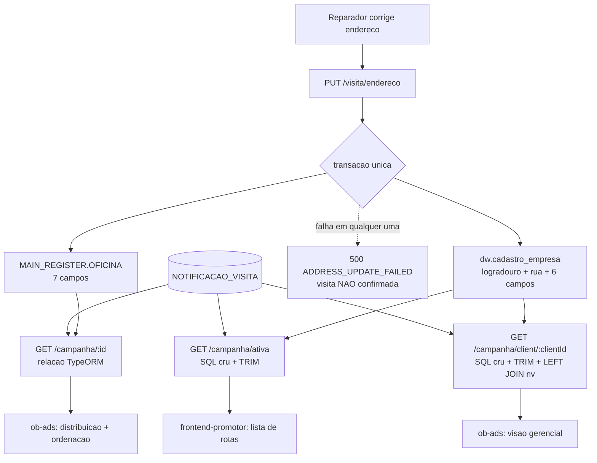

# Visibilidade do Status de Confirmação de Visita — Design

**Spec**: `.specs/features/status-confirmacao-visibilidade/spec.md`
**Status**: Draft

---

## Architecture Overview

Três frentes independentes, sem ordem forçada entre elas:

1. **Escrita** — `PUT /visita/endereco` passa a gravar o endereço corrigido nas duas tabelas (`MAIN_REGISTER.OFICINA` e `dw.cadastro_empresa`) numa transação. Com isso as três consultas de campanha convergem sem nenhuma regra de precedência de fonte.
2. **Leitura** — `GET /campanha/client/:clientId` ganha o `LEFT JOIN` em `NOTIFICACAO_VISITA` que as outras duas consultas já têm, e as duas consultas em SQL cru passam a usar `TRIM` no `CONCAT` do logradouro.
3. **UI** — `ob-ads` e `frontend-promotor` consomem o `notificacaoVisita` que a API já devolve.



---

## Code Reuse Analysis

### Existing Components to Leverage

| Component | Location | How to Use |
| --- | --- | --- |
| `CampanhaService.montarNotificacaoVisita` | `service/campanhaService.ts:38` | Reusar sem alteração na consulta por cliente — já aplica `statusEfetivo` e devolve `undefined` quando não há status |
| `statusEfetivo` | `utils/statusNotificacaoVisita.ts:20` | Chamado via o helper acima; nenhuma nova regra de expiração |
| `NotificacaoVisitaStatusInfoSchema` | `schemas/rota.ts:221` | Já aninhado na resposta das três consultas via `RotaPromotorSchema` — nada a alterar, serve de referência para os tipos dos frontends |
| `queryBothAndMerge` | usado em `campanhaService.ts:398+` | Padrão de dual-DB já aplicado; a query legada continua join-free |
| Bloco `LEFT JOIN nv` de `/campanha/ativa` | `campanhaService.ts:232` | Copiar o mesmo shape de join e alias para a consulta por cliente |
| `visitaConfirmacaoService.atualizarEndereco` | `service/visitaConfirmacaoService.ts:180` | Ponto único de escrita; ganha a transação e o segundo `UPDATE` |
| `CAMPOS_ENDERECO` | `service/visitaConfirmacaoService.ts:12` | Allowlist de 7 campos, inalterada; é a entrada do split |
| Entity `Empresa` (`dw.cadastro_empresa`) | `entities/CadastroEmpresa.ts:12` | Já mapeia `logradouro`, `rua` e os 6 campos 1:1 — a escrita usa o repositório dessa entity |
| Suíte `__tests__/unit/campanhaServiceVisita.test.ts` | `__tests__/unit/` | Extensão natural para os testes da consulta por cliente |
| Suíte `__tests__/integration/visitaEndereco.test.ts` | `__tests__/integration/` | Já cobre o `PUT` em nível HTTP; ganha os casos de dual write |

### Integration Points

| System | Integration Method |
| --- | --- |
| `MAIN_REGISTER.OFICINA` | `UPDATE` já existente, agora dentro de transação |
| `dw.cadastro_empresa` | Novo `UPDATE` pelo mesmo `AppDataSourceSync` — mesmo banco, schema diferente, então a transação cobre as duas |
| Banco legado | Não tem `MAIN_REGISTER` nem `dw`; o caminho de escrita nunca o alcança e a query legada de rotas segue sem join |
| `ob-ads` / `frontend-promotor` | Consomem o payload existente; nenhum endpoint novo |

---

## Components

### `dividirLogradouro` (novo)

- **Purpose**: quebrar o `ENDERECO` de linha única no par `{ logradouro, rua }` que o `dw` espera.
- **Location**: `utils/logradouro.ts`
- **Interfaces**:
  - `dividirLogradouro(endereco: string | null): { logradouro: string | null; rua: string | null }`
- **Regra**: compara o primeiro token, sem acento e em minúsculas, contra `TIPOS_LOGRADOURO`. Casou → token vira `logradouro`, o restante (trim) vira `rua`. Não casou, ou a string tem só uma palavra, ou é vazia/`null` → `logradouro = null` e a string inteira vira `rua`.
- **`TIPOS_LOGRADOURO`**: derivado da distribuição real do PRD — `rua`, `avenida`, `rodovia`, `estrada`, `travessa`, `alameda`, `praça`, `quadra`. Lista fechada e explícita; valores não interpretados como `NP` e `M` ficam de fora de propósito.
- **Dependencies**: nenhuma — função pura, sem I/O.
- **Reuses**: o padrão de utilitário puro testável de `utils/telefone.ts` e `utils/haversine.ts`.

### `visitaConfirmacaoService.atualizarEndereco` (alterado)

- **Purpose**: gravar a correção nas duas tabelas de forma atômica antes de confirmar a visita.
- **Location**: `service/visitaConfirmacaoService.ts:180`
- **Mudança**: o `Oficina.update` solto vira um `AppDataSourceSync.transaction(...)` com dois `update` — `Oficina` com os 7 campos como hoje, e `Empresa` com o mesmo conteúdo, com o `ENDERECO` dividido. Qualquer erro mantém o `catch` atual e o retorno `ADDRESS_UPDATE_FAILED`, agora com as duas escritas revertidas.
- **Atenção — nomes de propriedade, não de coluna**: `update()` do TypeORM recebe propriedades da entity. Em `entities/CadastroEmpresa.ts` a coluna `logradouro` é a propriedade **`LOGRADOURO`** (`:31`) e a coluna `rua` é a propriedade **`ENDERECO`** (`:34`). Passar `{ logradouro, rua }` seria ignorado em silêncio — TypeORM não reclama de chave desconhecida.

```typescript
const { logradouro, rua } = dividirLogradouro(endereco.ENDERECO)
await manager.update(Empresa, { ID_OFICINA }, {
  LOGRADOURO: logradouro,   // -> coluna dw.cadastro_empresa.logradouro
  ENDERECO: rua,            // -> coluna dw.cadastro_empresa.rua
  NUMERO: endereco.NUMERO,
  COMPLEMENTO: endereco.COMPLEMENTO,
  BAIRRO: endereco.BAIRRO,
  CIDADE: endereco.CIDADE,
  ESTADO: endereco.ESTADO,
  CEP: endereco.CEP,
})
```
- **Dependencies**: `AppDataSourceSync`, entities `Oficina` e `Empresa`, `dividirLogradouro`.
- **Reuses**: a guarda de estado (`statusEfetivo`) e a ordem "escreve endereço → só então transiciona" já existentes.

### `CampanhaService.getCampanhasByClientId` (alterado)

- **Purpose**: devolver o status de confirmação por rota na consulta que alimenta a visão gerencial.
- **Location**: `service/campanhaService.ts:398`
- **Mudança, em duas partes — a segunda é a que costuma ser esquecida**:
  1. No `fullQuery` de rotas (`:441`), adicionar `LEFT JOIN "CAMPANHAS_OB"."NOTIFICACAO_VISITA" nv ON rp."ID_ROTA_PROMOTOR" = nv."ID_ROTA_PROMOTOR"` e as três colunas (`nv."STATUS"`, `nv."EXPIRA_EM"`, `nv."CONFIRMADO_EM"`) com o mesmo alias `NOTIFICACAO_*` de `/campanha/ativa`. `legacyQuery` não muda.
  2. Na montagem da rota (`:565-593`), anexar `notificacaoVisita`. **Esse trecho é um objeto literal com lista fixa de campos** — não um spread de `r` —, então coluna nova no SQL sem entrada ali é descartada em silêncio, sem erro de compilação nem de runtime. É o modo de falha mais provável desta task.
- **Diferença em relação a `/campanha/ativa`**: lá o mapeamento faz spread de `payloadRota` e anexa condicionalmente; aqui a rota é montada campo a campo. Mesmo resultado, escrita diferente — não copiar o trecho de lá sem adaptar.
- **Dependencies**: `montarNotificacaoVisita`.
- **Reuses**: join e aliases idênticos aos de `/campanha/ativa`, para as duas consultas não divergirem.

### Consultas em SQL cru — `TRIM` no endereço (alterado)

- **Purpose**: impedir espaço à esquerda quando `logradouro` é nulo.
- **Location**: **quatro** ocorrências, não duas — cada consulta tem também um caminho de enriquecimento para rotas vindas do banco legado:
  - `service/campanhaService.ts:216` — `/campanha/ativa`, query principal
  - `service/campanhaService.ts:265` — `/campanha/ativa`, enriquecimento das rotas legadas
  - `service/campanhaService.ts:448` — `/campanha/client/:clientId`, query principal
  - `service/campanhaService.ts:489` — `/campanha/client/:clientId`, enriquecimento das rotas legadas
- **Mudança**: `CONCAT(ce.logradouro, ' ', ce.rua)` vira `TRIM(CONCAT(COALESCE(ce.logradouro,''), ' ', COALESCE(ce.rua,'')))` nas quatro. Deixar uma de fora produz endereço com espaço à esquerda só para rota legada — divergência difícil de notar em revisão.

### Schema de resposta — **nada a fazer** (verificado)

- **Location**: `schemas/campanha.ts:127` (`RotaPromotorSchema`), `:196` (`CampanhaPromotorSchema`), `:214` (`CampanhaWithRelationsSchema`), `:247` (`GetCampanhasByClientIdResponseSchema`)
- **Constatação**: `RotaPromotorSchema` já declara `notificacaoVisita: NotificacaoVisitaStatusInfoSchema.optional()`, e a cadeia de aninhamento faz esse campo valer para as respostas de `/campanha/:id` **e** `/campanha/client/:clientId`. O `/openapi.json` já documenta o campo.
- **Ação**: nenhuma alteração de schema. Vira teste de regressão — se o join for adicionado e o schema mudar de forma, o contrato quebra silenciosamente.

### Tipos de rota nos frontends (alterado)

- **Purpose**: sem o campo declarado, o badge não compila em nenhum dos dois repos.
- **Location**: três interfaces, todas hoje sem `notificacaoVisita`:
  - `ob-ads/types/vinculo.ts:44` — `CampanhaPromotorRota`, usado pelas telas de distribuição e ordenação
  - `ob-ads/app/(dashboard)/dashboard/campanha-para-promotores/visao/components/types.ts:12` — `RotaPromotor`, usado pela visão gerencial
  - `frontend-promotor/lib/types.ts:50` — `RotaAPI`, usado pela lista de rotas da campanha ativa
- **Mudança**: adicionar `notificacaoVisita?: { STATUS: string; CONFIRMADO_EM?: string | null }` nas três. Opcional em todas, porque rota sem notificação e rota legada não trazem o campo.

### `StatusConfirmacaoBadge` — `ob-ads` (novo)

- **Purpose**: indicador único usado nas duas telas, para não divergirem.
- **Location**: `ob-ads/app/(dashboard)/dashboard/campanha-para-promotores/components/StatusConfirmacaoBadge.tsx`
- **Interfaces**: `({ notificacaoVisita }: { notificacaoVisita?: { STATUS: string; CONFIRMADO_EM?: string | null } })`
- **Mapeamento**: `CONFIRMADO` → confirmada (com data quando houver); `PENDENTE`/`ENVIADO`/`DISPENSADO` → pendente; `EXPIRADO`/`FALHOU` → não vai receber; campo ausente → não renderiza nada.
- **Consumo**: `RotasDistributionSection.tsx` e `RouteOrderingSection.tsx`, ambos já com `vinculo.rotasPromotor` em mãos.
- **Reuses**: componentes de badge do design system já usado nessas telas.

### Indicador de status — `frontend-promotor` (novo)

- **Purpose**: mesmo indicador na lista de rotas da campanha ativa.
- **Location**: `frontend-promotor/components/route-carousel.tsx` — renderiza os cards de rota (`:112` e `:141`), composto por `components/home-screen.tsx`, que carrega via `getCampanhaAtiva` (`service/campanha.service.ts:62`)
- **Mapeamento**: idêntico ao do `ob-ads`; repos separados, sem código compartilhado, então a paridade é garantida por teste, não por import.
- **Atenção — este repo normaliza o payload**: `normalizeRota` converte a rota da API (SCREAMING_SNAKE, `RotaAPI`) para um modelo local em snake_case (`RotaPromotor`, `lib/types.ts:143` — `id_rota_promotor`, `status`, `done_at`). O componente **nunca vê** a forma da API. Então a cadeia completa é: `RotaAPI` ganha o campo → `normalizeRota` copia → `RotaPromotor` local declara em snake_case (`notificacao_visita?: { status: string; confirmado_em: string | null }`) → carrossel renderiza. Pular o passo do mapper faz o campo chegar `undefined` no componente, sem erro nenhum.

### Contagem na visão gerencial — `ob-ads` (alterado)

- **Purpose**: taxa de confirmação da campanha.
- **Location**: `ob-ads/app/(dashboard)/dashboard/campanha-para-promotores/visao/components/GerencialView.tsx`
- **Mudança**: derivar confirmadas/não confirmadas de `campanhasDetail`, que o componente já recebe por prop e já percorre (`GerencialView.tsx:44-48`). Sem nova chamada.
- **Atenção — não reusar `allRotas`**: a lista existente filtra `DONE_AT !== null`, ou seja, só visitas **já realizadas**. Confirmação é sobre visitas **futuras**; contar em cima dela devolveria quase zero e pareceria um bug do backend. A contagem precisa de sua própria travessia, sem filtro de `DONE_AT`.

---

## Data Models

Nenhuma coluna nova. O que muda é só o par de destino da escrita:

```typescript
// utils/logradouro.ts
interface LogradouroDividido {
  logradouro: string | null   // dw.cadastro_empresa.logradouro — o tipo
  rua: string | null          // dw.cadastro_empresa.rua — o nome
}

// 'Avenida Nova'    -> { logradouro: 'Avenida', rua: 'Nova' }
// 'Rua das Flores'  -> { logradouro: 'Rua',     rua: 'das Flores' }
// 'Chacara do Ze'   -> { logradouro: null,      rua: 'Chacara do Ze' }
// ''                -> { logradouro: null,      rua: '' }
```

Limites de coluna: `OFICINA.ENDERECO` é `varchar(200)` e `dw.rua` também, então dividir a string nunca estoura o destino.

---

## Error Handling Strategy

| Error Scenario | Handling | User Impact |
| --- | --- | --- |
| `UPDATE` em `OFICINA` falha | Transação reverte; `ADDRESS_UPDATE_FAILED` | `500`; visita **não** confirmada; usuário pode tentar de novo (comportamento atual, preservado) |
| `UPDATE` em `dw.cadastro_empresa` falha (grant, lock, indisponibilidade) | Transação reverte as duas escritas; mesmo `ADDRESS_UPDATE_FAILED` | Igual acima — nunca uma tabela atualizada e a outra não |
| Oficina sem linha em `dw.cadastro_empresa` | `UPDATE` afeta 0 linhas, não é erro; a escrita em `OFICINA` vale e a confirmação segue | Confirmação normal |
| Rota sem linha em `NOTIFICACAO_VISITA` | `montarNotificacaoVisita` devolve `undefined`; o campo é omitido | Rota renderiza sem indicador |
| Rota vinda do banco legado | Query legada sem join; campo ausente | Igual acima |
| `notificacaoVisita.STATUS` desconhecido pela UI | Badge cai no caso "sem indicador" em vez de quebrar | Rota renderiza sem indicador |

---

## Risks & Concerns

| Concern | Location (file:line) | Impact | Mitigation |
| --- | --- | --- | --- |
| Split por lista fechada erra em tipos fora da lista (`Viela`, `Largo`, `Setor`, …) | `utils/logradouro.ts` (novo) | Endereço inteiro cai em `rua`, `logradouro` nulo — leitura correta graças ao `TRIM`, mas a coluna perde a semântica | Degradação escolhida e explícita. A lista cobre os 8 tipos que respondem por ~136k das 146k linhas do PRD; ampliar é trivial e não muda contrato |
| Nenhuma rota de `/campanha/*` tem autenticação | `routes/CampanhaRoute.ts:211,251`; risco aberto nº 1 do `STATE.md` | Status de confirmação e endereço saem por endpoint aberto | Pré-existente e fora do escopo (registrado na spec). Esta feature não cria endpoint nem muda exposição |
| `getCampanhasByClientId` já é pesada (PERF-01) | `service/campanhaService.ts:398` | Regressão de tempo de resposta no dashboard | O join é sobre `ID_ROTA_PROMOTOR` com `UNIQUE` do lado de `NOTIFICACAO_VISITA` — cardinalidade 1:1, sem multiplicação de linhas. Baseline definido na spec: mediana de 5 chamadas antes/depois |
| Controllers não têm teste em todo o repo | `.specs/codebase/TESTING.md` | Mudanças de payload passam sem cobertura no nível HTTP | Cobrir na camada de serviço (unit) e usar a suíte de integração `visitaEndereco` para o caminho HTTP do `PUT`, que já existe |
| 3 suítes de integração legadas falham no teardown por FK | `STATE.md` (blockers) | Ruído ao rodar `test:integration` | Pré-existente, não é regressão desta feature; rodar as suítes de visita e campanha e comparar com o baseline conhecido |

---

## Tech Decisions

| Decision | Choice | Rationale |
| --- | --- | --- |
| Corrigir na escrita, não na leitura | `PUT /visita/endereco` grava nas duas tabelas | Elimina regra de precedência de fonte nas três consultas; DBA liberou `UPDATE` no `dw` |
| Atomicidade | Uma transação do `AppDataSourceSync` cobrindo os dois `UPDATE` | Mesmo banco, schemas diferentes; sem isso surge o estado "uma tabela sim, outra não", que nenhuma consulta saberia reconciliar |
| Split do logradouro | Lista fechada de tipos + fallback para `rua` inteira | `logradouro` é o tipo e `rua` é o nome em 134k linhas; nenhuma linha tem `rua` sem `logradouro`, então gravar tudo em `rua` criaria forma inédita |
| `TRIM` na leitura | Aplicado nas duas consultas em SQL cru | O fallback do split grava `logradouro = NULL`, e `CONCAT(NULL,' ',x)` deixa espaço à esquerda |
| Badge compartilhado dentro de cada repo | Um componente em `ob-ads` para as duas telas; outro em `frontend-promotor` | Repos separados não compartilham código; um componente por repo evita divergência entre telas do mesmo repo |
| Alias do join na consulta por cliente | Iguais aos de `/campanha/ativa` (`NOTIFICACAO_STATUS`, `NOTIFICACAO_EXPIRA_EM`, `NOTIFICACAO_CONFIRMADO_EM`) | Permite reusar `montarNotificacaoVisita` sem adaptador e mantém as duas consultas legíveis lado a lado |

> **Candidato a decisão de projeto (`AD-NNN`)**: "endereço corrigido por confirmação de visita grava em `MAIN_REGISTER.OFICINA` **e** `dw.cadastro_empresa`, na mesma transação". Vale além desta feature — qualquer escrita futura de endereço herda a regra. Registrar em `.specs/project/STATE.md` na fase de Execute, junto do commit que implementar a transação.
